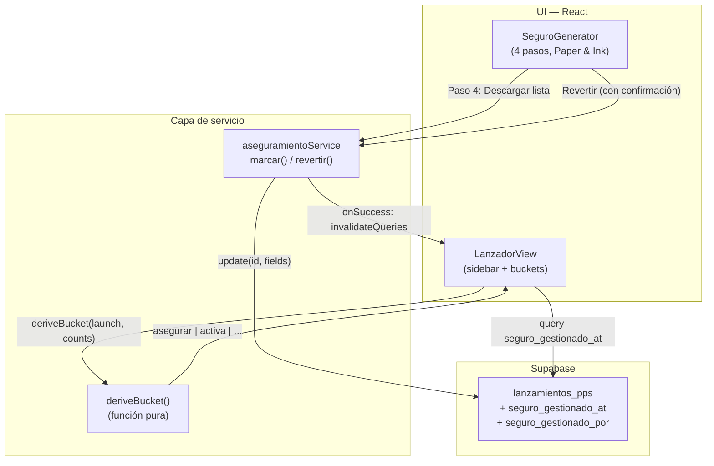
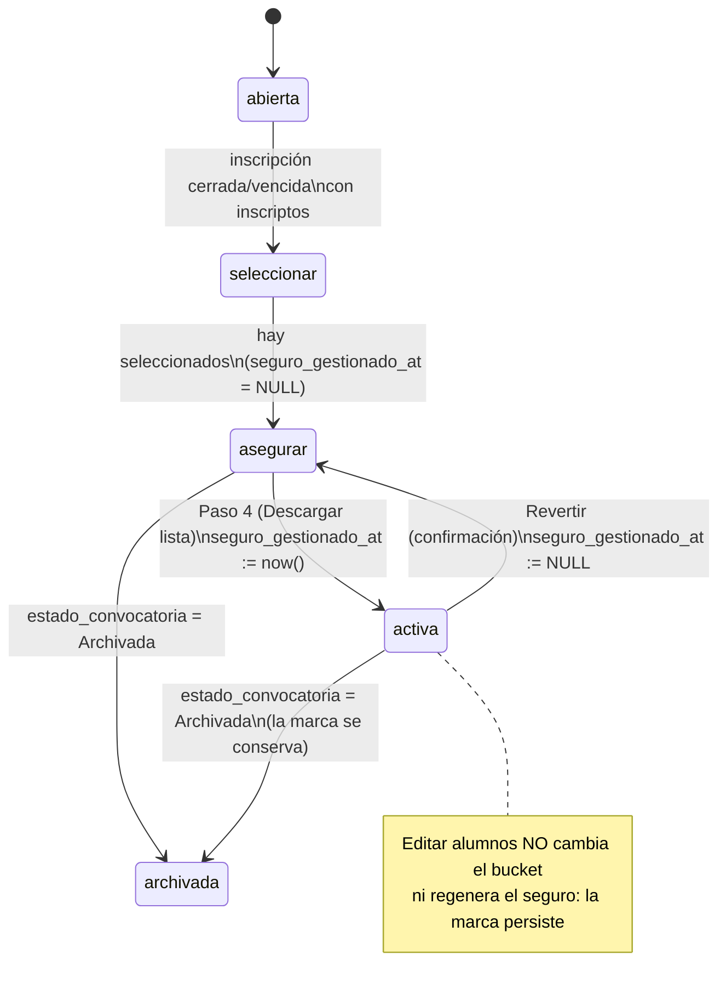
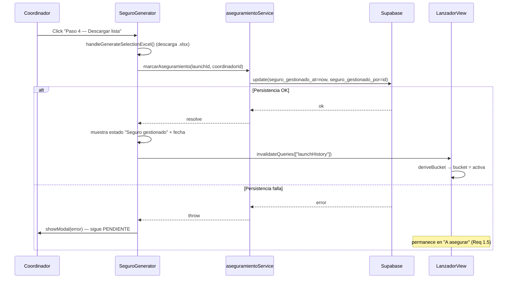

# Design Document

## Overview

Esta funcionalidad agrega una **marca persistente de "seguro gestionado"** a nivel Lanzamiento y reescribe la lógica del Lanzador para que un Lanzamiento salga de la categoría "A asegurar" cuando esa marca existe. El disparador del cierre es el **Paso 4 (Descargar lista)** del Generador_De_Seguros, que se rediseña desde cero en el sistema visual "Paper & Ink" v3 y entra directo desde la PPS (sin el paso previo de "Seleccionar convocatorias").

El alcance técnico cubre cinco capas:

1. **Migración SQL**: dos columnas nuevas en `lanzamientos_pps` (`seguro_gestionado_at`, `seguro_gestionado_por`).
2. **Constantes y tipos**: campos en `dbConstants.ts` y tipos en `types/supabase.ts`.
3. **Capa de servicio**: funciones puras de derivación de bucket + funciones de marcar/revertir aseguramiento.
4. **`LanzadorView`**: query del nuevo campo, derivación de buckets `asegurar`/`activa` desde `seguro_gestionado_at`, badge "seguro gestionado" en el sidebar, e invalidación de queries de TanStack.
5. **`SeguroGenerator` rediseñado**: 4 pasos en sesión, paso 4 dispara el guardado, estado "asegurado" + reversión.

La decisión de diseño central es que la transición a "Activas" **se deriva en el cliente** a partir de `seguro_gestionado_at` y **no toca `estado_convocatoria`**. Esto evita acoplar el aseguramiento con la automatización de auto-archivado (`archive_lanzamientos_after_start_grace`) y con otras reglas que dependen de `estado_convocatoria`/`estado_gestion`.

### Decisiones de diseño y trazabilidad

| Decisión                                                                            | Justificación                                                                      | Requirements                    |
| ----------------------------------------------------------------------------------- | ---------------------------------------------------------------------------------- | ------------------------------- |
| Marca a nivel Lanzamiento (no por convocatoria)                                     | El bucket opera por Lanzamiento; el seguro se gestiona por institución como unidad | 2.1, 2.2                        |
| Dos columnas en `lanzamientos_pps` (no tabla de auditoría)                          | Más simple y robusto; alineado con `plantilla_seguro_url`, `estado_gestion`        | 3.1, 8 (auditoría queda futura) |
| Bucket `activa` derivado de `seguro_gestionado_at`, sin tocar `estado_convocatoria` | No acoplar con auto-archivado ni otras automatizaciones                            | 6.1, 6.3                        |
| Paso 4 (Descargar lista) cierra el aseguramiento                                    | Confirmado por el usuario: completar el paso 4 ES la confirmación                  | 1.1, 9.8                        |
| Si falla la persistencia, no marcar y conservar en "A asegurar"                     | Integridad: la UI no miente sobre el estado real                                   | 1.5                             |
| Reversión con confirmación que borra `seguro_gestionado_at`                         | Única vía para volver de "Activas" a "A asegurar"                                  | 5.1, 5.2, 5.3                   |
| La marca persiste si cambian los alumnos en "Activas"                               | No se regenera seguro al editar lista                                              | 2.3, 6.x                        |
| Pasos 1–3 solo como progreso en sesión (no persisten)                               | SUPUESTO mínimo; persistir el detalle requeriría tabla de auditoría                | 4.1, 4.2                        |

## Architecture

El flujo conecta el Generador_De_Seguros (UI) con la base vía una capa de servicio fina, y el Lanzador deriva los buckets a partir del estado persistido.



### Diagrama de estados/transiciones del bucket

El foco de este spec es la transición `asegurar ⇄ activa`, gobernada por `seguro_gestionado_at`. La precedencia de `borrador` y `archivada` (derivadas de `estado_convocatoria`) se mantiene por encima de la marca.



### Reglas de derivación del bucket

La derivación se centraliza en una función pura `deriveBucket`. El orden de evaluación garantiza exclusividad mutua (Requirement 6.2) y la precedencia correcta:

```
1. estado = borrador                         → borrador
2. estado = archivada                         → archivada   (precede a la marca, Req 6.4)
3. seguro_gestionado_at != null               → activa      (Req 6.1, 6.3, 3.2)
4. estado = activa                            → activa
5. totalSel > 0                               → asegurar    (Req 3.3, 4.1)
6. (cerrada | (abierta & vencida)) & insc>0   → seleccionar
7. cerrada | (abierta & vencida)              → archivada
8. resto                                       → abierta
```

El cambio respecto del código actual es la inserción de la regla **3** (marca → `activa`) antes de la regla `totalSel > 0`. Así, un Lanzamiento con seleccionados pero con `seguro_gestionado_at` no nulo deja de caer en `asegurar` y pasa a `activa`.

## Components and Interfaces

### 1. Migración SQL

Archivo nuevo: `supabase/migrations/20260601120000_add_seguro_gestionado_to_lanzamientos.sql`

- Agrega `seguro_gestionado_at timestamptz null` y `seguro_gestionado_por uuid null` con `add column if not exists`.
- `NULL` = no asegurado; fecha = asegurado.
- Comentarios documentales en ambas columnas.
- No agrega `CHECK`, no toca `estado_convocatoria` ni RLS existente (las políticas de admin sobre `lanzamientos_pps` ya cubren `UPDATE`).
- `seguro_gestionado_por` referencia conceptual a `auth.users(id)`; se deja como `uuid` sin FK estricta para mantener simetría con el resto del esquema y evitar fallos si el id de admin no está en `auth.users`.

### 2. Constantes y tipos

`src/constants/dbConstants.ts` (junto a los `FIELD_*_LANZAMIENTOS` existentes):

```ts
export const FIELD_SEGURO_GESTIONADO_AT_LANZAMIENTOS = "seguro_gestionado_at";
export const FIELD_SEGURO_GESTIONADO_POR_LANZAMIENTOS = "seguro_gestionado_por";
```

`src/types/supabase.ts` — agregar a `lanzamientos_pps` en `Row`, `Insert` y `Update`:

```ts
seguro_gestionado_at: string | null; // Row
seguro_gestionado_por: string | null; // Row
// Insert/Update: ambos opcionales (?: string | null)
```

`mapLanzamiento` (en `src/utils/mappers.ts`) no requiere cambios: `toAppRecord` ya copia todas las columnas; los nuevos campos quedan accesibles vía `l[FIELD_SEGURO_GESTIONADO_AT_LANZAMIENTOS]`.

### 3. Capa de servicio

Archivo nuevo: `src/services/aseguramientoService.ts`

```ts
// Función PURA de derivación de bucket (extraída de LanzadorView)
export type SidebarBucket =
  | "borrador"
  | "abierta"
  | "seleccionar"
  | "asegurar"
  | "activa"
  | "archivada";

export interface BucketInput {
  dbState: UIState; // estado mapeado (borrador/abierta/cerrada/activa/archivada)
  seguroGestionadoAt: string | null;
  totalSel: number;
  totalInsc: number;
  vencida: boolean;
}

export function deriveBucket(input: BucketInput): SidebarBucket;

// Marcar aseguramiento completado (dispara el Paso 4)
export async function marcarAseguramiento(
  lanzamientoId: string,
  coordinadorId: string | null
): Promise<void>;
// → db.lanzamientos.update(id, {
//     seguro_gestionado_at: new Date().toISOString(),
//     seguro_gestionado_por: coordinadorId,
//   })
// Lanza si falla la persistencia (lo maneja el caller, Req 1.5).

// Revertir aseguramiento
export async function revertirAseguramiento(
  lanzamientoId: string,
  coordinadorId: string | null
): Promise<void>;
// → db.lanzamientos.update(id, { seguro_gestionado_at: null, seguro_gestionado_por: coordinadorId })
```

`deriveBucket` es la pieza clave: pura, sin efectos, testeable con PBT. `coordinadorId` se obtiene de `useAuth().authenticatedUser?.id` (el `id` es el `auth.users.id`, un uuid). Si fuera `null` (sesión admin sin perfil), se persiste `null` en `seguro_gestionado_por` sin bloquear la marca temporal.

### 4. Cambios en `LanzadorView`

- **Query**: `launchHistory` ya trae el row completo de `lanzamientos_pps` (vía `db.lanzamientos.getAll`), por lo que `seguro_gestionado_at` viaja automáticamente al agregar la columna; no se necesita una query nueva. Solo se lee `l[FIELD_SEGURO_GESTIONADO_AT_LANZAMIENTOS]` dentro del `useMemo` de `entries`.
- **Derivación**: reemplazar el bloque inline `if/else` del bucket por una llamada a `deriveBucket(...)`, pasando `seguroGestionadoAt`.
- **Badge "seguro gestionado"**: nuevo flag `seguroGestionado: boolean` en `SidebarEntry`; el sidebar muestra un chip/dot junto al Lanzamiento cuando es `true` (Req 7.1). La `metaLine` del bucket `activa` muestra "Seguro gestionado · {fecha}" cuando hay marca.
- **Invalidación**: `marcar`/`revertir` invalidan `["launchHistory"]` (y, por consistencia, `["convCountsByLaunch"]`, `["consentByLaunch"]`) para refrescar el sidebar.

```ts
// dentro del useMemo de entries
const seguroAt = (l[FIELD_SEGURO_GESTIONADO_AT_LANZAMIENTOS] as string | null) ?? null;
const bucket = deriveBucket({
  dbState,
  seguroGestionadoAt: seguroAt,
  totalSel,
  totalInsc,
  vencida,
});
const seguroGestionado = bucket !== "archivada" && seguroAt != null;
```

### 5. `SeguroGenerator` rediseñado

Props (sin cambios de firma; se elimina el uso del paso de selección):

```ts
interface SeguroGeneratorProps {
  showModal: (title: string, message: string) => void;
  isTestingMode?: boolean;
  preSelectedLanzamientoId?: string | null; // ahora REQUERIDO en la práctica (contexto PPS)
}
```

Comportamiento:

- **Sin paso "Seleccionar convocatorias"**: arranca directo cargando el Lanzamiento `preSelectedLanzamientoId` y compilando sus `studentsForReview` (reutiliza la lógica de `handleProceedToReview`, pero con `lanzamiento_id` fijo). Req 9.1, 9.2.
- **Header**: institución (`nombre_pps`), fecha de inicio y cantidad de seleccionados. Req 9.4.
- **4 pasos en orden** con estado de ejecución en sesión (`Set<number>` o flags), señalando el Paso 4 como cierre. Req 9.3, 4.2, 4.3:
  1. **Descargar seguro** → `handleDownloadTemplate` (Storage `documentos_seguros`). Req 9.5.
  2. **Copiar datos** → `handleCopyToClipboard` (TSV al portapapeles). Req 9.6.
  3. **Enviar a Sergio** → `handleSendToAdmin` (mailto a `mesadeayuda.patagonia@uflouniversidad.edu.ar`). Req 9.7.
  4. **Descargar lista** → `handleGenerateSelectionExcel` + en `onSuccess` llama a `marcarAseguramiento(...)`. Req 9.8, 1.1.
- **Pasos no bloqueantes**: el Paso 4 se puede ejecutar sin los previos (Req 4.4); requiere `seleccionados >= 1` (Req 1.2, 1.3).
- **Estado asegurado**: si el Lanzamiento ya tiene `seguro_gestionado_at`, en vez de mostrar el flujo pendiente, muestra "Seguro gestionado" + fecha + botón "Revertir" (con `window.confirm`). Req 9.10, 7.2, 5.3.
- **Estética**: solo tokens/clases Paper & Ink (`.seg*`), tipografías Hanken/JetBrains Mono, chips y dots de estado; sin estilos del diseño anterior. Req 9.9.



## Data Models

### Tabla `lanzamientos_pps` (columnas nuevas)

| Columna                 | Tipo          | Nulo | Default | Semántica                                                                           |
| ----------------------- | ------------- | ---- | ------- | ----------------------------------------------------------------------------------- |
| `seguro_gestionado_at`  | `timestamptz` | sí   | `null`  | `null` = no asegurado; fecha = momento del Aseguramiento_Completado (Req 3.1)       |
| `seguro_gestionado_por` | `uuid`        | sí   | `null`  | `auth.users.id` del Coordinador que ejecutó el Paso 4 o la reversión (Req 1.4, 5.4) |

Invariante de datos: `seguro_gestionado_por` solo es significativo cuando `seguro_gestionado_at` no es nulo o cuando registra la última reversión. La completitud del aseguramiento se determina **únicamente** por `seguro_gestionado_at` (Req 2.2, 3.4).

### Tipo de entrada de derivación (cliente)

```ts
interface BucketInput {
  dbState: UIState; // de estado_convocatoria mapeado
  seguroGestionadoAt: string | null; // de seguro_gestionado_at
  totalSel: number; // RPC get_convocatoria_counts_by_launch
  totalInsc: number; // idem
  vencida: boolean; // inscripcionVencida(fecha_fin_inscripcion)
}
```

### `SidebarEntry` (extensión)

```ts
interface SidebarEntry {
  id: string;
  nombre: string | null;
  uiState: UIState;
  bucket: SidebarBucket;
  orientacion: string | null;
  metaLine: string;
  needsAction: boolean;
  seguroGestionado: boolean; // NUEVO — controla el badge del sidebar (Req 7.1)
}
```

### Formato de datos copiados (Paso 2)

Cada estudiante produce una fila separada por tabulaciones con 7 campos en orden fijo: `apellido, nombre, dni, legajo, cargo, lugarCompleto, duracionCompleta`. Las filas se unen con `\n` (Req 9.6).

## Correctness Properties

_Una propiedad es una característica o comportamiento que debe cumplirse en todas las ejecuciones válidas del sistema: una afirmación formal sobre lo que el sistema debe hacer. Las propiedades son el puente entre la especificación legible por humanos y las garantías de correctitud verificables por máquina._

El núcleo testeable de esta feature es la función pura `deriveBucket(input)`, junto con dos funciones de formato/derivación (`buildHeader`, `buildClipboardText`). Las propiedades se cuantifican universalmente sobre entradas generadas. Las acciones con efectos (persistir, descargar, mailto, confirmar) se cubren con tests de ejemplo/edge en la sección Testing Strategy, no con PBT.

Convención de tipos para los generadores: `dbState ∈ {borrador, abierta, cerrada, seleccionada, activa, archivada}`, `seguroGestionadoAt ∈ {null, ISO-string}`, `totalSel ∈ [0, 50]`, `totalInsc ∈ [0, 50]`, `vencida ∈ {true, false}`.

### Property 1: La marca de aseguramiento clasifica en Activas y nunca en A_Asegurar

_Para todo_ `BucketInput` cuyo `seguroGestionadoAt` no sea nulo y cuyo `dbState` no sea `borrador` ni `archivada`, `deriveBucket` debe devolver `activa`, sin importar el valor de `totalSel`, `totalInsc` ni `vencida`. En particular, nunca debe devolver `asegurar`.

**Validates: Requirements 1.1, 2.2, 2.3, 3.2, 6.1, 6.3**

### Property 2: Sin marca, con seleccionados y estado no terminal, clasifica en A_Asegurar

_Para todo_ `BucketInput` con `seguroGestionadoAt` nulo, `totalSel >= 1` y `dbState` no perteneciente a `{borrador, archivada, activa}`, `deriveBucket` debe devolver `asegurar`, independientemente del progreso de pasos 1–3 (que no altera la entrada).

**Validates: Requirements 3.3, 4.1**

### Property 3: La reversión es el inverso de la marca (round-trip de la transición)

_Para todo_ `BucketInput` con `totalSel >= 1` y `dbState` no perteneciente a `{borrador, archivada, activa}`: evaluar `deriveBucket` con `seguroGestionadoAt = <fecha>` debe dar `activa`, y volver a evaluarlo con `seguroGestionadoAt = null` (manteniendo el resto igual) debe devolver `asegurar`. Marcar y revertir regresa el Lanzamiento a su bucket original.

**Validates: Requirements 5.2**

### Property 4: Totalidad y exclusividad del bucket

_Para todo_ `BucketInput` arbitrario, `deriveBucket` debe devolver exactamente un valor del conjunto `{borrador, abierta, seleccionar, asegurar, activa, archivada}`, sin lanzar excepciones ni devolver `undefined`. (Esto garantiza también el determinismo usado al recargar el Lanzador.)

**Validates: Requirements 6.2, 3.4**

### Property 5: El estado Archivada tiene precedencia sobre la marca

_Para todo_ `BucketInput` con `dbState = archivada`, `deriveBucket` debe devolver `archivada`, tenga o no tenga `seguroGestionadoAt` un valor.

**Validates: Requirements 6.4**

### Property 6: El indicador "seguro gestionado" refleja la marca

_Para todo_ `BucketInput`, el flag derivado `seguroGestionado` debe ser `true` si y solo si `seguroGestionadoAt` no es nulo y el bucket resultante no es `archivada`.

**Validates: Requirements 7.1**

### Property 7: El texto a copiar preserva una fila por estudiante con los 7 campos en orden

_Para toda_ lista de estudiantes, el texto generado para el portapapeles debe tener exactamente tantas líneas como estudiantes, y cada línea debe contener 7 campos separados por tabulación en el orden fijo `apellido, nombre, dni, legajo, cargo, lugarCompleto, duracionCompleta`.

**Validates: Requirements 9.6**

### Property 8: El encabezado contiene institución, fecha y cantidad de seleccionados

_Para todo_ Lanzamiento con `N` Estudiantes_Seleccionados, el encabezado armado por el Generador debe contener el nombre de la institución, la fecha de inicio y el número `N`.

**Validates: Requirements 9.4**

## Error Handling

| Escenario                                      | Manejo                                                                                                                                                                                                 | Requirements |
| ---------------------------------------------- | ------------------------------------------------------------------------------------------------------------------------------------------------------------------------------------------------------ | ------------ |
| Falla la persistencia al marcar (Paso 4)       | `marcarAseguramiento` lanza; el Generador captura, llama `showModal("Error", ...)`, **no** marca el flujo como completado en sesión y **no** invalida queries. El Lanzamiento permanece en `asegurar`. | 1.5          |
| Falla la persistencia al revertir              | Se captura, `showModal` con el detalle; el estado mostrado no cambia hasta confirmar éxito.                                                                                                            | 5.x          |
| Paso 4 sin seleccionados (`totalSel = 0`)      | El Paso 4 está deshabilitado; si se fuerza, se aborta con aviso. La marca no se escribe.                                                                                                               | 1.2, 1.3     |
| `coordinadorId` nulo (sesión admin sin perfil) | Se persiste `seguro_gestionado_at` igualmente y `seguro_gestionado_por = null`. La marca temporal es el determinante; el autor es informativo.                                                         | 1.4          |
| Falla la descarga de plantilla (Paso 1)        | `handleDownloadTemplate` ya intenta nombre alternativo y, si falla, `showModal` con detalle. No afecta la marca.                                                                                       | 9.5          |
| Falla la generación del Excel (Paso 4)         | Si la generación del listado falla, **no** se invoca `marcarAseguramiento` (el cierre solo ocurre con descarga exitosa).                                                                               | 9.8, 1.5     |
| Clipboard no disponible (Paso 2)               | `navigator.clipboard.writeText` rechaza → toast de error; no bloquea el resto.                                                                                                                         | 9.6          |
| RLS rechaza el `UPDATE`                        | El error de Supabase se propaga como falla de persistencia (mismo manejo que la primera fila).                                                                                                         | 1.5          |

Principio transversal: **la UI nunca muestra un estado de aseguramiento que no esté confirmado en la base**. La marca de sesión de "completado" solo se activa tras el `resolve` de la persistencia.

## Testing Strategy

### Enfoque dual

- **Property-based tests**: validan `deriveBucket`, `buildClipboardText` y `buildHeader` (lógica pura) con entradas generadas. Cubren las 8 Correctness Properties.
- **Unit/Render tests**: validan ejemplos concretos, edge cases y los efectos (persistencia mockeada, descarga, mailto, confirmación, render condicional).

### Property-based testing

- **Librería**: `fast-check` (ecosistema Vitest/Jest del proyecto). No se implementa PBT desde cero.
- **Iteraciones**: mínimo **100** por propiedad (`{ numRuns: 100 }`).
- **Ubicación sugerida**: `src/services/__tests__/aseguramientoService.property.test.ts` y `src/components/admin/__tests__/seguroGenerator.property.test.ts`.
- **Etiquetado**: cada test property lleva un comentario con el formato:
  `// Feature: flujo-aseguramiento-pps, Property {n}: {texto de la propiedad}`
- **Generadores**: un `arbBucketInput` que produce `dbState`, `seguroGestionadoAt` (mezcla de `null` y fechas ISO válidas), `totalSel`, `totalInsc`, `vencida`. Para P2/P3 se restringe `dbState` al subconjunto no terminal. Para P7 un `arbStudents` (lista de `StudentForReview` con campos arbitrarios, incluyendo tabs/saltos de línea como edge case del generador). Para P8 un `arbLanzamiento` con `N` seleccionados.
- Cada propiedad del documento se implementa con **un único** test property.

### Unit / Render tests (ejemplos y edge cases)

Lógica de servicio (mocks de `db.lanzamientos.update`):

- `marcarAseguramiento` envía `seguro_gestionado_at` (ISO) y `seguro_gestionado_por` (id). (1.4, 3.1)
- `revertirAseguramiento` envía `seguro_gestionado_at: null` y registra el id. (5.1, 5.4, 8.1)
- `marcarAseguramiento` propaga el error si el `update` rechaza (no se traga la excepción). (1.5)

Generador (render con `@testing-library/react`, efectos mockeados):

- Precarga del Lanzamiento desde `preSelectedLanzamientoId` sin paso de selección. (9.1, 9.2)
- Render de 4 pasos en orden con el Paso 4 señalado como cierre. (4.3, 9.3)
- Paso 4 habilitado sin pasos previos cuando hay seleccionados; deshabilitado con `totalSel = 0`. (4.4, 1.2, 1.3)
- Indicadores de progreso de pasos 1–3 en sesión. (4.2)
- Paso 1 descarga plantilla (mock storage) y marca el paso. (9.5)
- Paso 3 abre mailto al destinatario correcto y marca el paso. (9.7)
- Paso 4 invoca generación de Excel y luego `marcarAseguramiento`. (9.8)
- Estado "ya asegurado": muestra "Seguro gestionado" + fecha + botón Revertir; reversión pide confirmación. (9.10, 7.2, 5.3)

Lanzador (render):

- Badge "seguro gestionado" visible cuando `seguro_gestionado_at` no es nulo y el bucket no es `archivada`. (7.1)
- Tracker de consentimiento visible en `asegurar`. (7.3, ya existente)

### Verificación de migración / esquema (smoke)

- La migración agrega `seguro_gestionado_at` y `seguro_gestionado_por` a `lanzamientos_pps` (idempotente con `if not exists`). (2.1, 3.1)
- No se modifica `estado_convocatoria` ni la función de auto-archivado. (6.x)

### Fuera de alcance de PBT (justificación)

- **CSS / Paper & Ink** (9.9): estética, no computable → revisión visual.
- **Persistencia y efectos** (1.4, 3.1, 5.1, 5.4, 9.5, 9.7, 9.8): side-effects sobre Supabase/Storage/mailto → mocks, no propiedades universales.
- **Tabla de auditoría** (8.2, 8.3): no implementada en esta versión (mejora futura).
