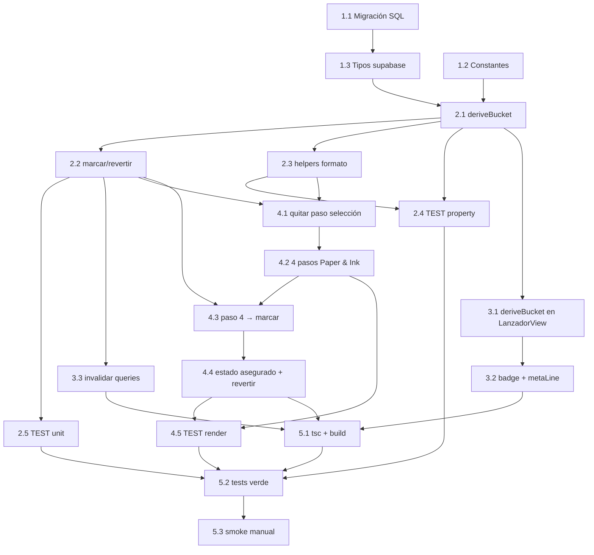

# Implementation Plan

## Overview

Plan incremental para implementar el flujo de aseguramiento de PPS. El orden
permite verificar de a poco: primero la base de datos y la lógica pura (con
tests), después el cableado en el Lanzador y por último el rediseño del
generador. Verificación recomendada por tarea: `npx tsc --noEmit` y, donde
aplique, los tests del paso.

Las cinco capas del diseño: (1) migración + constantes + tipos, (2) capa de
servicio con `deriveBucket` puro y tests, (3) cableado en `LanzadorView`,
(4) rediseño del `SeguroGenerator` (Paper & Ink, 4 pasos, sin paso de
selección), (5) verificación final.

## Tasks

### 1. Base de datos, constantes y tipos

- [x] 1.1 Crear migración SQL `supabase/migrations/20260601120000_add_seguro_gestionado_to_lanzamientos.sql`
  - Agregar `seguro_gestionado_at timestamptz null` y `seguro_gestionado_por uuid null` con `add column if not exists`.
  - Comentarios documentales en ambas columnas (`comment on column`).
  - No tocar `estado_convocatoria`, RLS ni la función de auto-archivado.
  - _Requirements: 3.1, 2.1_

- [x] 1.2 Agregar constantes de campo en `src/constants/dbConstants.ts`
  - `FIELD_SEGURO_GESTIONADO_AT_LANZAMIENTOS = "seguro_gestionado_at"`
  - `FIELD_SEGURO_GESTIONADO_POR_LANZAMIENTOS = "seguro_gestionado_por"`
  - _Requirements: 3.1_

- [x] 1.3 Agregar los campos a `src/types/supabase.ts` en `lanzamientos_pps` (Row, Insert, Update)
  - `seguro_gestionado_at: string | null` y `seguro_gestionado_por: string | null` en Row; opcionales en Insert/Update.
  - Verificar que `mapLanzamiento` no requiere cambios (toAppRecord copia todo).
  - _Requirements: 3.1_

### 2. Capa de servicio + tests de lógica pura

- [x] 2.1 Crear `src/services/aseguramientoService.ts` con la función pura `deriveBucket`
  - Tipos `SidebarBucket` y `BucketInput` según el design.
  - Orden de evaluación: borrador → archivada → (marca → activa) → activa → (totalSel>0 → asegurar) → seleccionar → archivada → abierta.
  - _Requirements: 3.2, 3.3, 6.1, 6.2, 6.3, 6.4_

- [x] 2.2 Agregar `marcarAseguramiento` y `revertirAseguramiento` al servicio
  - `marcarAseguramiento(id, coordinadorId)` → `db.lanzamientos.update` con `seguro_gestionado_at = now ISO` + `seguro_gestionado_por`. Propaga error si falla (no lo traga).
  - `revertirAseguramiento(id, coordinadorId)` → `update` con `seguro_gestionado_at: null` + registra el coordinador.
  - _Requirements: 1.1, 1.4, 1.5, 5.1, 5.4_

- [x] 2.3 Extraer helpers puros de formato del generador a `aseguramientoService.ts` (o helper aparte)
  - `buildClipboardText(students)` → una fila por estudiante, 7 campos TSV en orden fijo.
  - `buildHeader(launch)` → institución + fecha + cantidad de seleccionados.
  - _Requirements: 9.4, 9.6_

- [x] 2.4 [TEST · property-based] `src/services/__tests__/aseguramientoService.property.test.ts` con fast-check (≥100 runs)
  - Property 1: marca → `activa`, nunca `asegurar` (Req 1.1, 2.2, 2.3, 3.2, 6.1, 6.3).
  - Property 2: sin marca + seleccionados + estado no terminal → `asegurar` (Req 3.3, 4.1).
  - Property 3: round-trip marcar/revertir vuelve al bucket original (Req 5.2).
  - Property 4: totalidad y exclusividad del bucket (Req 6.2, 3.4).
  - Property 5: `archivada` tiene precedencia sobre la marca (Req 6.4).
  - Property 6: flag `seguroGestionado` ⇔ marca y bucket ≠ archivada (Req 7.1).
  - Property 7: `buildClipboardText` preserva filas/campos (Req 9.6).
  - Property 8: `buildHeader` contiene institución, fecha y N (Req 9.4).
  - Etiquetar cada test: `// Feature: flujo-aseguramiento-pps, Property {n}: {texto}`.
  - _Requirements: 1.1, 2.2, 2.3, 3.2, 3.3, 3.4, 4.1, 5.2, 6.1, 6.2, 6.3, 6.4, 7.1, 9.4, 9.6_

- [x] 2.5 [TEST · unit] `src/services/__tests__/aseguramientoService.test.ts` con mocks de `db.lanzamientos.update`
  - `marcarAseguramiento` envía `seguro_gestionado_at` ISO + `seguro_gestionado_por`.
  - `revertirAseguramiento` envía `seguro_gestionado_at: null` + coordinador.
  - `marcarAseguramiento` propaga el error si el update rechaza.
  - _Requirements: 1.4, 1.5, 3.1, 5.1, 5.4_

### 3. Cableado en LanzadorView

- [x] 3.1 Reemplazar la derivación inline del bucket por `deriveBucket(...)`
  - Leer `seguro_gestionado_at` desde el launch en el `useMemo` de `entries`.
  - Pasar `seguroGestionadoAt` a `deriveBucket`; conservar `totalSel`, `totalInsc`, `vencida`.
  - _Requirements: 3.2, 3.3, 6.1, 6.3_

- [x] 3.2 Extender `SidebarEntry` con `seguroGestionado: boolean` y mostrar badge en el sidebar
  - Badge/dot "seguro gestionado" cuando `seguroGestionado === true`.
  - `metaLine` del bucket `activa` muestra "Seguro gestionado · {fecha}" cuando hay marca.
  - _Requirements: 7.1, 7.2_

- [x] 3.3 Invalidar queries de TanStack tras marcar/revertir
  - Invalidar `["launchHistory"]` (y por consistencia los conteos de convocatorias/consentimientos) para refrescar el sidebar.
  - _Requirements: 6.1, 3.4_

### 4. Rediseño del SeguroGenerator (Paper & Ink, 4 pasos)

- [x] 4.1 Quitar el paso "Seleccionar convocatorias" y arrancar desde el Lanzamiento de contexto
  - Usar `preSelectedLanzamientoId` para precargar el lanzamiento y compilar `studentsForReview` con `lanzamiento_id` fijo.
  - Header con institución, fecha y cantidad de seleccionados (usar `buildHeader`).
  - _Requirements: 9.1, 9.2, 9.4_

- [x] 4.2 Implementar los 4 pasos en orden con progreso en sesión (Paper & Ink)
  - Paso 1 Descargar seguro (`handleDownloadTemplate`), Paso 2 Copiar datos (`buildClipboardText`), Paso 3 Enviar a Sergio (`handleSendToAdmin`), Paso 4 Descargar lista (`handleGenerateSelectionExcel`).
  - Estado de ejecución por paso (Set/flags), Paso 4 señalado como cierre. Pasos 1–3 no bloquean el 4.
  - Solo tokens/clases Paper & Ink; sin estilos del diseño anterior.
  - _Requirements: 4.2, 4.3, 4.4, 9.3, 9.5, 9.6, 9.7, 9.9_

- [x] 4.3 Conectar el Paso 4 con `marcarAseguramiento` y manejar errores
  - Tras descargar el listado con éxito, llamar `marcarAseguramiento(id, coordinadorId)`.
  - Si falla la persistencia: `showModal` con el error, NO marcar como completado, NO invalidar (queda en "A asegurar").
  - Paso 4 deshabilitado si `totalSel = 0`.
  - _Requirements: 1.1, 1.2, 1.3, 1.5, 9.8_

- [x] 4.4 Estado "ya asegurado" + reversión
  - Si el lanzamiento tiene `seguro_gestionado_at`: mostrar "Seguro gestionado" + fecha + botón "Revertir".
  - Revertir pide confirmación (`window.confirm`) y llama `revertirAseguramiento`.
  - _Requirements: 5.3, 7.2, 9.10_

- [x] 4.5 [TEST · render] `src/components/admin/__tests__/seguroGenerator.test.tsx` con efectos mockeados
  - Precarga sin paso de selección; 4 pasos en orden con el 4 como cierre.
  - Paso 4 habilitado sin pasos previos cuando hay seleccionados; deshabilitado con `totalSel = 0`.
  - Paso 4 invoca generación de Excel y luego `marcarAseguramiento`.
  - Estado "ya asegurado" muestra fecha + Revertir; reversión pide confirmación.
  - _Requirements: 1.2, 1.3, 4.3, 4.4, 5.3, 9.1, 9.2, 9.3, 9.8, 9.10_

### 5. Verificación final

- [x] 5.1 Correr `npx tsc --noEmit` y `npx vite build`; corregir errores.
  - _Requirements: todos_

- [x] 5.2 Correr la suite de tests del feature (property + unit + render) y confirmar verde.
  - _Requirements: todos los testeables_

- [ ] 5.3 Smoke manual: abrir una PPS en "A asegurar", completar el paso 4, verificar que pasa a "Activas" con badge "seguro gestionado"; revertir y verificar que vuelve a "A asegurar".
  - _Requirements: 1.1, 5.2, 6.1, 6.3, 7.1_

## Task Dependency Graph

```json
{
  "waves": [
    { "wave": 1, "tasks": ["1.1", "1.2", "1.3"] },
    { "wave": 2, "tasks": ["2.1"] },
    { "wave": 3, "tasks": ["2.2", "2.3"] },
    { "wave": 4, "tasks": ["2.4", "2.5", "3.1", "4.1"] },
    { "wave": 5, "tasks": ["3.2", "3.3", "4.2"] },
    { "wave": 6, "tasks": ["4.3"] },
    { "wave": 7, "tasks": ["4.4"] },
    { "wave": 8, "tasks": ["4.5", "5.1"] },
    { "wave": 9, "tasks": ["5.2"] },
    { "wave": 10, "tasks": ["5.3"] }
  ]
}
```



## Notes

- Verificación incremental: la lógica pura (`deriveBucket`) y sus property-based tests (2.4) se completan antes de cablear la UI, de modo que el comportamiento de buckets quede garantizado antes de tocar `LanzadorView` y el generador.
- Las tareas marcadas `[TEST · ...]` son de testing: 2.4 (property-based, fast-check ≥100 runs), 2.5 (unit con mocks), 4.5 (render con efectos mockeados).
- Las acciones con efectos (persistencia, descargas, mailto, confirmación) se cubren con mocks; no entran en PBT.
- La migración (1.1) requiere aplicarse en Supabase para el smoke manual (5.3); el resto del trabajo de frontend puede avanzar con los tipos ya declarados (1.3).
- El destino "Activas" se deriva en el cliente vía `deriveBucket`; en ningún paso se modifica `estado_convocatoria`.
