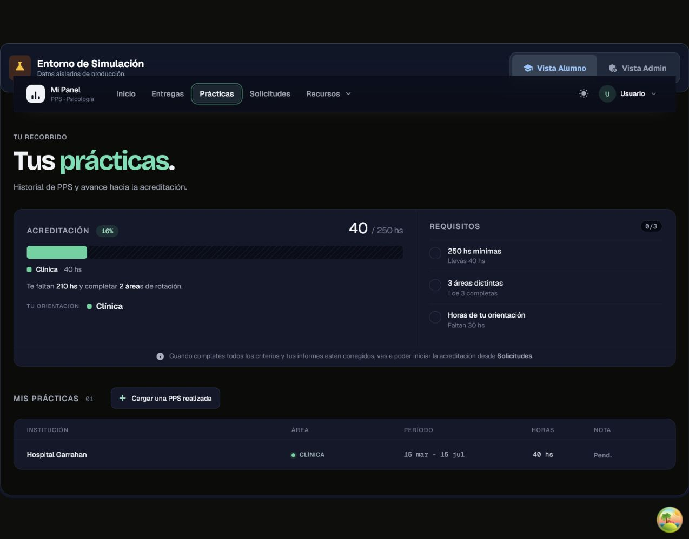
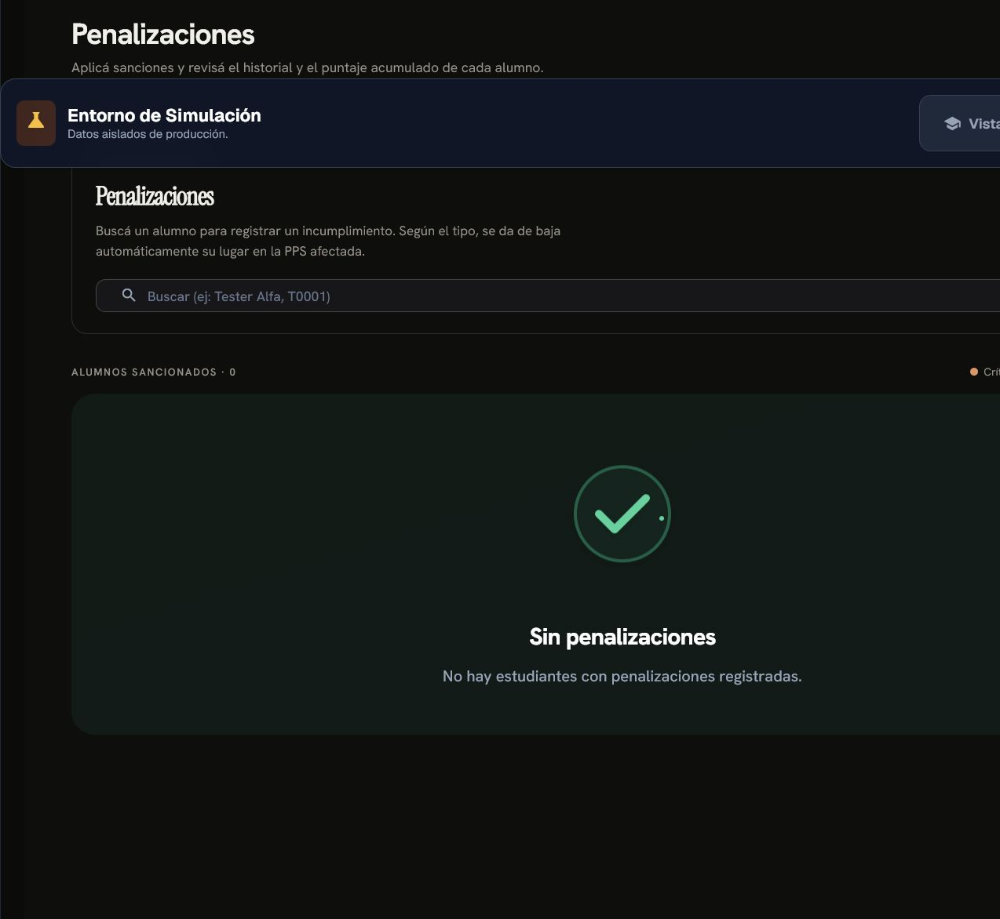
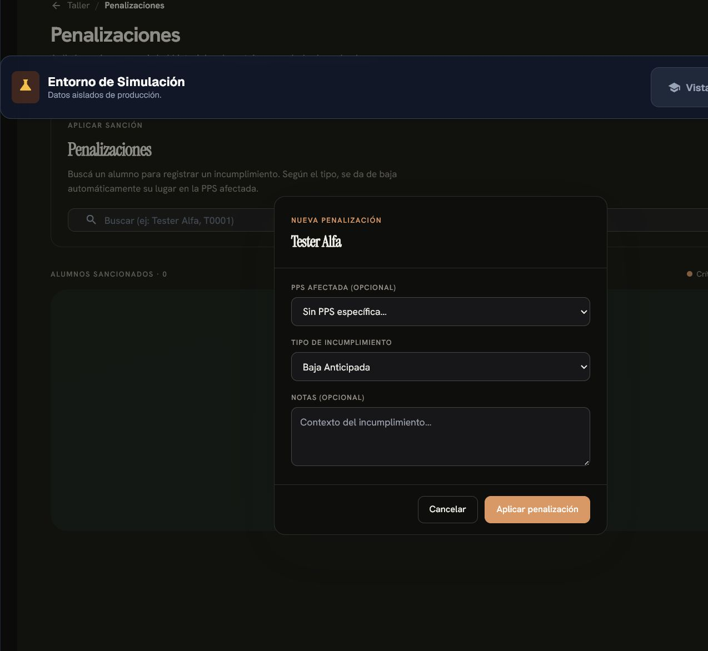

# Informe revisado: PPS desaprobadas y penalizaciones

Fecha de revisión: 20 de julio de 2026

## Resultado ejecutivo

La integración fue aplicada en la base productiva y en la interfaz. Una PPS marcada como `Desaprobada` permanece en el historial, aporta 0 horas y 0 rotaciones, y genera en la misma operación una penalización activa de **100 puntos** vinculada a la práctica. El flujo normal del 99% de las PPS continúa usando solamente `En curso` y `Finalizada`.

La revisión de Gmail confirmó **7 casos institucionales**. Todos fueron reconstruidos o vinculados con su práctica, quedaron visibles como desaprobados y tienen exactamente una penalización activa de 100 puntos. Los siete estudiantes continúan con estado `Activo` y sin fecha de finalización en Mi Panel; esto significa que su recorrido administrativo no está cerrado, no necesariamente que estén asistiendo hoy a una institución.

Los dos correos enviados el 20 de julio incorporaron a **Evelyn Garay (legajo 20679)** y **Marianela García Julieta (legajo 22552)**. Evelyn tiene además una PPS `En curso` cuya fecha prevista termina el 1 de agosto de 2026. Marianela no tiene una PPS con fecha vigente; conserva registros `En curso` antiguos y 209 horas computables, por lo que requiere seguimiento, pero no corresponde considerarla finalizada.

## 1. Corrección del modelo

Mi Panel no acredita oficialmente horas PPS. Su función es gestionar las prácticas y ofrecer un seguimiento referencial. La acreditación oficial ocurre después, cuando el estudiante completó todos los requisitos, presentó y corrigió sus informes y Coordinación carga en SAC el ciclo completo. Hasta ese momento SAC puede mostrar 0 horas aunque el estudiante haya realizado varias PPS.

Por eso no corresponde crear un resultado académico `Pendiente / Aprobada / Desaprobada`. El modelo correcto es excepcional:

- `En curso`: la PPS está desarrollándose.
- `Finalizada`: la institución no reportó un incumplimiento y la práctica terminó. En la realidad operativa equivale a una práctica satisfactoria, aunque el informe pueda seguir en Moodle pendiente de entrega o corrección.
- `Desaprobada`: la institución decidió que no puede avalar la práctica por incumplimientos del estudiante.
- `No se pudo concretar`: la práctica no llegó a desarrollarse; no es una desaprobación.
- `Convenio Realizado`: estado administrativo/legacy que debe conservarse mientras siga teniendo uso.

No se agrega el término “Aprobada” en la interfaz. Tampoco se incorpora un paso manual para aprobar el 99% de las prácticas: el sistema debe mantener el flujo normal simple y concentrar el trabajo administrativo en el caso excepcional.

## 2. Qué representa una desaprobación

Una PPS desaprobada:

- siempre surge de una decisión de la institución;
- es un evento excepcional y grave;
- se apoya en un informe de la institución;
- se comunica formalmente al estudiante, explicando por qué desaprobó;
- afecta la relación de UFLO con una institución que ofrece formación sin recibir una contraprestación;
- constituye por sí misma una penalización.

Las dos causas canónicas son:

1. **Incumplimiento de asistencia y responsabilidad:** menos del 80% de asistencia, ausencias sin aviso u otros incumplimientos sostenidos.
2. **Falta de participación o actitud profesional:** presencia física sin posición activa, sin involucramiento o sin realizar las actividades esperadas.

Una misma desaprobación puede tener ambas causas. Debe generarse un solo evento y una sola penalización, con las dos causas asociadas, para evitar duplicar puntos por un mismo hecho.

## 3. Diferencia entre seguimiento y acreditación oficial

| Concepto                          | Sistema                                           | Momento                           | Alcance                                         |
| --------------------------------- | ------------------------------------------------- | --------------------------------- | ----------------------------------------------- |
| Seguimiento de horas y rotaciones | Mi Panel                                          | Durante todo el recorrido         | Referencial, editable y útil para planificación |
| Evidencia de realización          | Planilla firmada o informe aprobado en PPS online | Durante/cierre de cada PPS        | Respaldo ante errores o inconvenientes          |
| Acreditación oficial              | SAC                                               | Al completar todos los requisitos | Carga final del ciclo completo, no PPS por PPS  |

Esto tiene una consecuencia de producto importante: en Mi Panel conviene hablar de **horas computables para el seguimiento** o **avance hacia la acreditación final**, y reservar “acreditación oficial” para la carga final en SAC.

La tarjeta actual titulada “Acreditación” puede inducir a pensar que cada PPS ya está cargada oficialmente. Se recomienda renombrarla a **“Seguimiento de horas y rotaciones”** y agregar una aclaración permanente:

> Registro referencial de Mi Panel. La carga oficial en SAC se realiza al finalizar todos los requisitos PPS.

El documento descargable desde Mi Panel también debe identificarse como constancia o reporte de seguimiento, no como certificado de horas cargadas en SAC.

## 4. Comportamiento requerido para una práctica desaprobada

La práctica no se elimina ni desaparece del historial. Debe:

- cambiar su `estado` a `Desaprobada`;
- mostrar **“Desaprobada por la institución”**;
- conservar institución, fechas, orientación y horas previstas/realizadas como historia;
- aportar 0 horas al seguimiento computable;
- aportar 0 rotaciones;
- no contribuir a los requisitos para solicitar acreditación final;
- continuar en el documento descargable, claramente separada de las prácticas computables;
- generar automáticamente una penalización vinculada;
- mostrarse como antecedente en futuras inscripciones.

Ejemplo de presentación para el estudiante:

```text
Hospital X · Clínica
Desaprobada por la institución
40 h realizadas/informadas · 0 h computables
Motivo: incumplimiento de asistencia y participación
```

No conviene sobrescribir el campo de horas con cero, porque se perdería información histórica. El cero debe ser el resultado del cálculo de horas computables.

## 5. Flujo administrativo propuesto

### Paso 1 — Informe institucional

La institución comunica el problema y presenta el informe. Coordinación identifica la práctica y revisa que la causa corresponda a una de las categorías canónicas.

Salud del flujo actual: **no existe un registro estructurado**; los casos no pueden distinguirse de una práctica finalizada o de una baja común.

### Paso 2 — Registrar “Desaprobada por la institución”

Desde la PPS activa o desde la ficha del estudiante, el administrador elige **Registrar desaprobación**.

Campos requeridos:

- estudiante y práctica;
- fecha de decisión/informe;
- una o ambas causas;
- explicación visible para el estudiante;
- informe o referencia documental de la institución;
- observación interna de Coordinación;
- medio y fecha de comunicación al estudiante.

Salud propuesta: **clara y excepcional**; no añade trabajo al 99% de las PPS que finalizan normalmente.

### Paso 3 — Confirmación de consecuencias

Antes de guardar, la interfaz debe indicar:

- la práctica permanecerá en el historial;
- sus horas y rotación dejarán de computarse;
- se creará una penalización automáticamente;
- el estudiante deberá ser notificado;
- el caso quedará en el registro institucional.

Salud propuesta: **necesita confirmación reforzada**, porque una carga errónea modifica seguimiento, ranking y antecedentes.

### Paso 4 — Operación transaccional

Una sola operación debe:

1. cambiar la práctica a `Desaprobada`;
2. crear la penalización canónica;
3. registrar el evento en `admin_action_log`;
4. registrar/encolar la notificación;
5. conservar el vínculo con práctica, convocatoria e institución.

Si cualquiera de esas acciones falla, no debe persistir ninguna. El sistema actual realiza algunas bajas y penalizaciones en llamadas separadas; eso debe corregirse.

Salud propuesta: **crítica para la integridad**.

### Paso 5 — Comunicación y cierre

El caso atraviesa estados administrativos simples:

- `Informe recibido`.
- `Revisado por Coordinación`.
- `Estudiante notificado`.
- `Cerrado`.

No se trata de que UFLO vuelva a evaluar o desapruebe al estudiante. Una eventual revisión sólo corrige errores fácticos o de carga; la decisión que da origen al estado pertenece a la institución.

Salud propuesta: **protege la trazabilidad y la relación institucional**.

## 6. Integración implementada con penalizaciones

Se creó el tipo canónico:

```text
PPS desaprobada por la institución
```

Propiedades:

- se crea siempre y automáticamente al marcar la práctica;
- queda vinculada mediante `practica_id`, no por texto libre;
- contiene las causas de la desaprobación;
- usa puntos positivos;
- se cuenta una sola vez aunque haya dos causas;
- sólo puede anularse al corregir formalmente el caso;
- nunca elimina la práctica.

Por decisión de Coordinación, la desaprobación vale **100 puntos** y queda como el antecedente de mayor gravedad del catálogo. Si un estudiante desaprueba dos PPS distintas, existirán dos eventos y ambos se acumularán. Dos causas informadas para la misma práctica no duplican la penalización.

### Hallazgo inicial y saneamiento aplicado

| Indicador                           | Resultado |
| ----------------------------------- | --------: |
| Penalizaciones totales              |        39 |
| Estudiantes penalizados             |        26 |
| Penalizaciones 2026                 |        23 |
| Estudiantes penalizados en 2026     |        20 |
| Penalizaciones con puntaje negativo |        13 |
| Estudiantes con saldo negativo      |         6 |

El ranking restaba el acumulado de penalizaciones. Por lo tanto, los valores negativos otorgaban una ventaja. Las 13 puntuaciones negativas fueron normalizadas al valor positivo canónico de su categoría. Tres filas vacías, sin estudiante ni incidente recuperable, se conservaron para auditoría como `Anulada` bajo el tipo `Registro inválido heredado`.

La regla de puntajes quedó centralizada en el cliente. Las nuevas penalizaciones guardan referencias estructuradas a práctica, inscripción y lanzamiento; las referencias históricas ambiguas se preservan y no fueron inventadas. El registro de una desaprobación ahora es atómico: si falla el cambio de estado, la penalización o la auditoría, no persiste ninguna parte.

### Estado de penalizaciones después de la integración

| Tipo                                     | Estado  | Puntos | Casos |
| ---------------------------------------- | ------- | -----: | ----: |
| PPS desaprobada por la institución       | Activa  |    100 |     7 |
| Abandono durante la PPS                  | Activa  |     70 |     2 |
| Baja sobre la fecha / ausencia en inicio | Activa  |     50 |     7 |
| Falta sin aviso                          | Activa  |     40 |     2 |
| Baja anticipada                          | Activa  |     30 |    24 |
| Baja administrativa / sin penalización   | Activa  |      0 |     1 |
| Registro inválido heredado               | Anulada |      0 |     3 |

En total quedan 46 filas históricas: 43 activas y 3 anuladas. Hay 31 estudiantes distintos con algún antecedente y 25 estudiantes con una penalización activa fechada en 2026.

## 7. Presentación en el seleccionador

El selector debe mostrar el antecedente de manera explícita, no sólo como una suma genérica de puntos:

```text
PPS desaprobada por institución · 2026
Causa: asistencia + falta de participación
Penalización activa: 100 puntos
```

El detalle visible para selección no debe incluir observaciones internas sensibles ni el informe completo de la institución. Sí debe mostrar:

- cantidad de PPS desaprobadas;
- año e institución;
- causa canónica;
- puntos y estado de la penalización;
- si el estudiante fue notificado.

Esto permite evaluar el antecedente sin descontextualizarlo y evita que la penalización aparezca como un número sin explicación.

## 8. Sección administrativa recomendada

En lugar de dos conceptos opcionales, la sección puede llamarse **“Antecedentes e incidentes PPS”** y tener:

- pestaña `Desaprobaciones institucionales`;
- pestaña `Otras penalizaciones`;
- filtros por año, institución, causa, estado del caso y estudiante;
- conteo anual de instituciones afectadas;
- casos pendientes de notificación;
- reincidencias;
- historial de correcciones y anulaciones.

El objetivo no es crear un ranking de instituciones ni exhibir casos innecesariamente, sino permitir que Coordinación gestione un problema institucional raro con suficiente trazabilidad.

## 9. Propuesta de datos y seguridad

### Cambio mínimo en `practicas`

Agregar `Desaprobada` al constraint de `practicas.estado` y campos específicos:

- `desaprobacion_fecha`.
- `desaprobacion_causas` (una o ambas causas canónicas).
- `desaprobacion_motivo_publico`.
- `desaprobacion_informe_ref`.
- `desaprobacion_notificado_at`.
- `desaprobacion_registrado_por`.

Las notas internas deben permanecer en `admin_action_log.metadata` o en una tabla administrativa, porque el estudiante puede leer su propia fila de práctica.

### Reglas de integridad

- Si `estado = 'Desaprobada'`, fecha, causa, motivo e informe/referencia son obligatorios.
- Sólo personal autorizado puede cambiar hacia o desde `Desaprobada`.
- Un estudiante no puede editar esos campos aunque tenga permiso para actualizar otros datos de su práctica.
- Debe existir exactamente una penalización activa de desaprobación por práctica.
- Una corrección exige motivo, actor y auditoría; no se borra el historial.

No se necesita backfill masivo ni marcar todas las finalizadas como aprobadas. Sólo se incorporan manualmente los casos históricos confirmados de desaprobación.

## 10. Regla central de cómputo

Crear una única función de dominio equivalente a:

```text
es_computable_en_panel = estado no está en ('Desaprobada', 'No se pudo concretar')
```

Debe utilizarse en:

- horas totales del estudiante;
- horas por orientación;
- rotaciones;
- requisitos de solicitud de acreditación;
- puntaje por horas en el seleccionador;
- gráficos y documentos descargables;
- métricas de avance;
- reportes de dirección y candidatos próximos a finalizar.

Una práctica desaprobada sí cuenta en métricas históricas como “prácticas iniciadas”, “casos institucionales” o “tasa de desaprobación”, pero no en horas o rotaciones computables.

## 11. Cambios de lenguaje en Mi Panel

El código y la FAQ ya contienen varias aclaraciones correctas: Mi Panel es referencial, la carga oficial no ocurre hasta completar las 250 horas y la planilla firmada es el respaldo de una PPS presencial.

Conviene reforzar esa consistencia en las pantallas principales:

| Texto actual           | Texto recomendado                         |
| ---------------------- | ----------------------------------------- |
| Acreditación           | Seguimiento de horas y rotaciones         |
| Horas acreditadas      | Horas registradas/computables en Mi Panel |
| Avance de acreditación | Avance hacia la acreditación final        |
| Documento de horas     | Reporte referencial de seguimiento PPS    |

No debe mostrarse un estado de carga en SAC porque Mi Panel no tiene integración ni evidencia directa de ese sistema.

## 12. FAQ propuesta

### ¿Qué significa que una PPS figure como finalizada en Mi Panel?

> Significa que la práctica terminó sin que la institución informara una desaprobación. Las horas que ves en Mi Panel son un seguimiento referencial: no se cargan oficialmente en SAC práctica por práctica. Cuando completes todos los requisitos, informes y correcciones, Coordinación gestionará la acreditación final del ciclo completo.

### ¿Qué pasa si una institución desaprueba mi PPS?

> Una institución puede desaprobar una PPS si no alcanzás el 80% de asistencia, faltás sin aviso o no sostenés una participación activa y responsable. La práctica seguirá apareciendo en tu historial como “Desaprobada por la institución”, pero sus horas y orientación no se computarán para completar el recorrido. Coordinación te notificará el motivo informado y el antecedente generará una penalización.

### ¿Por qué debo conservar la planilla de asistencia?

> Mi Panel es un seguimiento referencial y las horas no se cargan en SAC práctica por práctica. En una PPS presencial, la planilla firmada es el único documento que certifica su realización si existe un error o inconveniente. Guardala y subila junto con el informe. En las PPS online, el respaldo es el informe final corregido y aprobado.

Estas incorporaciones ya fueron realizadas en `src/views/student/StudentAulaView.tsx` junto con el nuevo estado.

## 13. Resultado del relevamiento de Gmail

Se revisaron búsquedas amplias por términos de desaprobación, asistencia, actitud, participación, informes institucionales y nombres de instituciones. La evidencia sólo se utilizó para clasificar los casos; las referencias internas de correo quedaron en la auditoría administrativa y no se exponen al estudiante.

| Estudiante                  | Legajo | Institución desaprobada                      | Fecha      | Causa canónica             | Horas computables restantes | Situación actual en Mi Panel                        |
| --------------------------- | -----: | -------------------------------------------- | ---------- | -------------------------- | --------------------------: | --------------------------------------------------- |
| Navarrete Gabriel Alejandro |  26370 | Subsecretaría de Familia - Hogar Convivencia | 26/11/2025 | Participación/actitud      |                         256 | Activo; registros `En curso` con fechas ya vencidas |
| Linares Lara                |  30923 | Centro Evaluador Camioneros                  | 16/03/2026 | Participación/actitud      |                         270 | Activa; última fecha prevista 17/07/2026            |
| Guillermo Gonzalo           |  32956 | Dige Espacio Terapéutico                     | 06/04/2026 | Asistencia/responsabilidad |                         203 | Activo; registros `En curso` con fechas ya vencidas |
| Silvana Pereyra             |  33440 | Dige Espacio Terapéutico                     | 06/04/2026 | Ambas causas               |                         120 | Activa; registros `En curso` con fechas ya vencidas |
| Orihuela Maximiliano David  |  23929 | Centro Evaluador Camioneros                  | 08/04/2026 | Ambas causas               |                         288 | Activo; última fecha prevista 04/07/2026            |
| Garay Evelyn                |  20679 | Dige Espacio Terapéutico                     | 20/07/2026 | Participación/actitud      |                         300 | Activa; otra PPS vigente hasta 01/08/2026           |
| García Marianela Julieta    |  22552 | Dige Espacio Terapéutico                     | 20/07/2026 | Participación/actitud      |                         209 | Activa; sin PPS con fecha actualmente vigente       |

Las “horas computables restantes” excluyen completamente la práctica desaprobada. Que un estudiante supere 250 horas no prueba que el ciclo esté acreditado: todavía pueden faltar rotaciones, informes, correcciones o la carga final en SAC.

Se excluyeron expresamente del listado:

- Mauricio Ariel Millan: baja voluntaria; corresponde analizarla como abandono, no como decisión institucional de desaprobación.
- Mariela Aragon, Carla Mendez y un intercambio de Gabriel de enero de 2026: correcciones de informe en Moodle, no desaprobaciones de PPS.
- Melanie Salazar: evidencia administrativa insuficiente para afirmar una desaprobación institucional.

## 14. Estado de implementación

### Fase 0 — Saneamiento de penalizaciones: completada

- Se normalizaron las 13 penalizaciones negativas.
- Se aplicó el catálogo canónico y la desaprobación en 100 puntos.
- Se impidió que una puntuación histórica negativa beneficie el ranking.
- Los vínculos históricos no demostrables se conservaron como tales; no se crearon asociaciones ficticias.

### Fase 1 — Estado excepcional y operación atómica: completada

- Agregar `Desaprobada` y los campos obligatorios.
- Crear el tipo de penalización vinculado a práctica.
- Implementar registro transaccional, auditoría y protección de columnas.
- Regenerar `src/types/supabase.ts` y ejecutar `npm run type-check`.

### Fase 2 — Cómputos y reportes: completada

- Centralizar `isPracticeComputable`.
- Actualizar horas, orientaciones, rotaciones, selector y solicitudes.
- Actualizar funciones SQL y métricas.
- Diferenciar participación histórica de avance computable.

### Fase 3 — Interfaces y comunicación: completada

- Acción contextual “Registrar desaprobación”.
- Gestión de casos institucionales.
- Presentación para estudiante y seleccionador.
- Registro de la fecha de notificación y del motivo comunicado; el envío del correo continúa siendo una gestión humana de Coordinación.
- Ajustes de lenguaje sobre Mi Panel/SAC.
- FAQ.

### Fase 4 — Pruebas y verificación: completada

- Desaprobada permanece visible y aporta cero.
- Finalizada sigue computando sin aprobación manual.
- Una desaprobación con dos causas genera una sola penalización.
- El estudiante no puede cambiar el estado protegido.
- El proceso completo hace commit o rollback en conjunto.
- Los documentos indican que son referenciales.
- Los reportes separan seguimiento, incidentes y acreditación final.

## 15. Criterios de aceptación

1. El flujo normal del 99% de las PPS no añade pasos administrativos.
2. El sistema nunca utiliza el estado `Aprobada`.
3. Una práctica puede pasar de `En curso` o `Finalizada` a `Desaprobada` si el informe institucional llega tarde.
4. La práctica permanece en el historial y en documentos.
5. Aporta 0 horas y 0 rotaciones al seguimiento.
6. Genera exactamente una penalización vinculada.
7. Admite una o ambas causas sin duplicar puntos.
8. Guarda el informe institucional y la comunicación al estudiante.
9. El seleccionador muestra el antecedente con contexto.
10. La corrección de un caso requiere motivo y deja auditoría.
11. Mi Panel no afirma que las horas ya estén cargadas en SAC.
12. La FAQ refuerza la conservación de la planilla de asistencia.

## 16. Evidencia visual del producto anterior

### Historial y seguimiento del estudiante



La pantalla ya presentaba las prácticas como historial y avance. La implementación incorporó `Desaprobada`, la excluyó de los cálculos y aclaró que el seguimiento no equivale a una carga oficial en SAC.

### Gestor de penalizaciones



La sección era una base útil; ahora distingue las desaprobaciones institucionales de otras penalizaciones y conserva el vínculo con la práctica.

### Formulario actual



El formulario anterior contemplaba abandono y ausencias. El nuevo flujo agrega el evento completo: referencia al informe institucional, causas combinables, cambio de estado, notificación y protección de la relación con la institución.

## 17. Trazabilidad técnica aplicada

- `src/logic/studentRules.ts`: centraliza qué prácticas computan horas y rotaciones.
- `src/views/student/AtlasPracticasView.tsx`: conserva la fila desaprobada, la diferencia visualmente y muestra 0 horas.
- `src/hooks/useSeleccionadorLogic.ts`: usa horas computables, penalizaciones activas y antecedentes estructurados.
- `src/constants/penalties.ts`: concentra los tipos y puntajes canónicos.
- `src/components/admin/SeleccionadorConvocatorias.tsx` y `src/views/admin/lanzador/ActivaView.tsx`: muestran el tag contextual y permiten registrar el caso desde la PPS.
- `src/components/admin/PenalizationManager.tsx`: agrega la sección de PPS desaprobadas y anula penalizaciones comunes sin borrar auditoría.
- `src/views/student/StudentAulaView.tsx`: explica el 80%, la decisión institucional, el carácter referencial de Mi Panel, SAC y la planilla.
- Las migraciones `20260720142924_pps_disapproval_and_penalty_integration.sql`, `20260720144257_fix_pps_disapproval_utf8.sql` y `20260720170000_index_pps_disapproval_audit_foreign_keys.sql` incorporan el estado, la operación atómica, la protección, los reportes, los índices de auditoría y los siete casos históricos confirmados.

## 18. Límites del relevamiento

- Mi Panel no puede verificar el estado real de SAC ni Moodle; la propuesta no simula esas integraciones.
- Gmail permitió confirmar los siete casos incorporados, pero no reemplaza una fuente institucional estructurada para casos futuros.
- Las capturas corresponden al modo de prueba local y no exponen datos reales.
- Los 100 puntos fueron aplicados por decisión de Coordinación. El texto concreto de cada comunicación sigue bajo criterio humano y no se automatizó.
