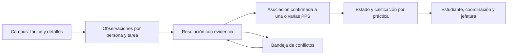

# Entregas Moodle: diagnóstico y propuesta de reconciliación

Fecha: 05/09/2026. Corte de base: 10:17 Argentina (13:17 UTC).
Repositorio examinado: HEAD `8218975`, con cambios de otras tareas ya presentes.
Estado de esta entrega: diagnóstico verificado, correcciones locales probadas y
diseño de la solución estructural. La bandeja de evidencia propuesta abajo
todavía no está implementada ni desplegada.

## Decisión recomendada

Conservar el índice como acelerador de lectura y construir la reconciliación
sobre la entrega observada de una persona en una tarea, antes de exigir una PPS
a la cual atribuirla. La regla que falta es:

> Una entrega válida se conserva aunque todavía no sepamos a qué práctica
> corresponde. La incertidumbre impide aplicar la nota, pero no borra la evidencia.

Las unidades institucionales ayudan a buscar candidatas. No prueban por sí solas
que un archivo cubra una PPS, dos orientaciones o dos períodos. La limpieza
histórica debe conservar las excepciones explícitas; el modelo dedicado desde
2027 evita seguir agregándolas.

## Evidencia verificada

### Campus: la medición pendiente quedó resuelta

Se utilizó el navegador integrado abierto por el responsable. Se cambió
temporalmente a Estudiante mediante el menú de Moodle y se comprobó
`userswitchedrole`, junto con las columnas del HTML recibido. Se restauró luego
el rol original.

| Lectura                 | Duración | Tamaño del HTML UTF-8 | Resultado                                 |
| ----------------------- | -------: | --------------------: | ----------------------------------------- |
| Índice, primera muestra |   908 ms |         354.548 bytes | 112 filas, 112 celdas `submissionstatus`  |
| Índice, segunda muestra | 1.310 ms |         354.548 bytes | 112 filas, una con entrega en esta cuenta |
| Detalle de CMID 946366  |   579 ms |         164.000 bytes | tabla individual de entrega presente      |

Las consultas usaron `cache: no-store`. El tamaño es el HTML decodificado,
no los bytes comprimidos de red. No se repitió el barrido docente de 35–40 s:
ese valor procede de la conversación anterior, no de una medición nueva.

Esto habilita usar el índice como optimización con fallback. No demuestra un
percentil de latencia ni la visibilidad real de todos los alumnos: cambiar de
rol conserva la identidad del profesor. La propia documentación de
[Moodle explica esta limitación](https://docs.moodle.org/500/en/Switch_roles).
No afirmar que un alumno real puede ver todas las tareas ocultas basándose en
esta prueba.

### Base viva: cobertura, no deuda académica

Consulta reproducible:
[`audit-moodle-delivery-coverage.sql`](../scripts/sql/audit-moodle-delivery-coverage.sql).
Es sólo lectura y requiere acceso administrativo a los diagnósticos privados.

Se reconciliaron 1.698 prácticas, 1.698 filas de la vista y 1.698 IDs distintos.

| Estado técnico de la vista         | Prácticas | Sin vínculo exacto |
| ---------------------------------- | --------: | -----------------: |
| Calificado                         |       743 |                  0 |
| Entregado                          |        77 |                  1 |
| Sin entrega en el snapshot elegido |       164 |                  0 |
| Sin lectura                        |       714 |                284 |

Los 714 casos sin lectura incluyen 499 PPS finalizadas, 99 PPS en curso,
9 PPS desaprobadas y 107 actividades especiales. No son 714 informes faltantes.
Algunas actividades especiales se resuelven directamente y deben conservar ese
circuito.

Entre las 285 prácticas sin vínculo exacto:

- 196 no tienen lanzamiento;
- 46 tienen unidad institucional sin tareas registradas;
- 43 pertenecen a una unidad con tareas, pero no tienen vínculo exacto.

Los 43 son un grupo para revisar, no un lote autorizado para vincular por
coincidencia institucional. Hay 107 pares estudiante–tarea con snapshots
asociados a más de una práctica. Esa cifra mide asociaciones existentes, no
cuántos informes efectivamente contiene cada entrega.

## Fallas estructurales encontradas

| Hallazgo                                                        | Evidencia                                                                                                                                    | Consecuencia                                                                          |
| --------------------------------------------------------------- | -------------------------------------------------------------------------------------------------------------------------------------------- | ------------------------------------------------------------------------------------- |
| El índice no realiza descubrimiento de extremo a extremo        | `fetchTasks` recorre sólo los CMID pedidos; `MoodleGradeSyncContext` persiste sólo sus asociaciones; el contrato rechaza CMID no solicitados | La entrega en otra tarea no entra, aunque el parser la haya visto                     |
| No hay solicitud si no hay vínculo                              | `buildPendingMoodleAssignments` omite prácticas sin enlace                                                                                   | Los casos sin vínculo no pueden recuperarse por el ingreso del alumno                 |
| El almacenamiento exige atribución previa                       | `ingest-moodle-grade-observation` exige `practicaId` y vínculo confirmado                                                                    | No existe un lugar donde guardar una entrega válida todavía sin resolver              |
| Jefatura y estudiante atribuyen de forma diferente              | La función viva de jefatura tiene candidatos por unidad; el ingestor estudiantil acepta vínculos exactos                                     | La misma evidencia puede admitirse por una vía y rechazarse por otra                  |
| La vista anunciada como única todavía no es consumida           | Sin referencias a `practica_estado_entrega` en `src` ni en cuerpos de funciones de PostgreSQL consultados                                    | Crear la vista no unificó las respuestas de las pantallas                             |
| El diagnóstico de jefatura no conserva una observación completa | La función viva almacena razón y conteos para filas sin candidata, sin nota, comentario ni fecha de entrega                                  | Corregir el vínculo exige volver a leer Moodle                                        |
| El índice docente podía confundirse con datos individuales      | Parser por descarte para la columna de nota, sin exigir `submissionstatus`                                                                   | Una columna numérica desconocida podía interpretarse como calificación                |
| El presupuesto de tiempo no cerraba                             | Cliente 15 s; índice 10 s; hasta siete tandas de detalles de 10 s para 20 CMID                                                               | Una respuesta válida podía llegar después de que el panel dejara de escuchar          |
| El comentario se perdía entre puente y servidor                 | `feedbackComment` existe en el contrato, pero no en el payload construido por el proveedor                                                   | Se perdía la información que distingue notas de informes compartidos                  |
| La deduplicación ignoraba contenido relevante                   | Comparaba estado, nota y parte de los adjuntos, pero no fecha ni comentario                                                                  | Una fecha recuperada o una corrección textual podía descartarse como noop             |
| Lo compartido dependía del lote                                 | El ingestor contaba sólo prácticas recibidas en la petición                                                                                  | Separar tandas o cerrar una PPS podía hacer parecer individual una entrega compartida |
| La calificación y la frescura siguen mezcladas                  | El frontend cierra tareas calificadas; el trigger vivo conserva el valor terminal                                                            | Mejorar el ingestor no basta para detectar o aplicar recorrecciones automáticamente   |

Además, el estado `complete` actual expresa que no quedan tareas programadas:
no certifica cobertura de todas las obligaciones del estudiante. Una caída de
consulta de vínculos también debe distinguirse de una lista realmente vacía en
el nuevo contrato.

## Arquitectura objetivo

### 1. Observación independiente de la práctica

Extender el sistema existente con una bandeja persistente de observaciones
Moodle, sin `practica_id` obligatorio. Identidad de origen:
`course_id + cmid + moodle_user_id`. Registrar también identidad local resuelta,
origen de lectura, versión de parser, hora observada y recibida, estado, nota y
escala brutas, comentario y evidencia documental derivada.

Conservar observaciones inmutables por petición y huella de contenido, y una
proyección de última lectura. No usar `observed_at` como fecha de entrega.
Si la página sólo expone la última modificación, conservar ese significado:
no fabricar un intento Moodle ni una fecha original.

La bandeja no necesita guardar nombres de archivos, documentos ni HTML. Mantiene
la política actual de clasificar nombres transitoriamente y descartarlos.

La identidad del estudiante se verifica del lado servidor. Una lectura desde
su navegador conserva la confianza `moodle_session_observed`; no se convierte
en evidencia firmada por Moodle. Una integración REST institucional de lectura
es el transporte preferido si UFLO puede habilitarla; el modelo no debe depender
de conseguir ese permiso para empezar.

### 2. Resolución separada y versionada

La relación observación–práctica admite varias prácticas por entrega, con
decisión explícita sobre qué acredita cada asociación. Debe registrar método,
evidencia, responsable, versión y revocación/sustitución. Separar:

- tarea donde se recomienda entregar;
- tarea donde se encontró evidencia;
- informes/PPS que esa evidencia efectivamente cubre;
- nota académica atribuida a cada PPS.

Los vínculos actuales siguen siendo evidencia confirmada. Las unidades
institucionales generan candidatos. No adoptar por nombre ni elegir el último
lanzamiento simplemente porque sea el más reciente.

Resolver contra el conjunto completo compatible del estudiante antes de filtrar
la pantalla por orientación. Una jefatura no debe obtener una falsa unicidad
porque otra candidata quedó fuera de su vista. Publicar luego sólo los datos
permitidos por su alcance.

### 3. Reglas para los conflictos históricos

| Situación                                             | Acción                                                                                                |
| ----------------------------------------------------- | ----------------------------------------------------------------------------------------------------- |
| Tarea confirmada y una única PPS compatible           | Asociación exacta, con procedencia                                                                    |
| Entrega en una tarea anterior de la misma institución | Conservar; generar candidata. Confirmar compatibilidad temporal/orientación o una excepción explícita |
| Dos PPS comparten una tarea                           | Conservar una entrega; no inferir que ambas se cumplieron por el mero hecho de existir archivos       |
| Comentario con dos notas distintas                    | Conservar el texto; proponer dos valores para revisión. No copiar el número general a ambas PPS       |
| Tarea compartida por instituciones distintas          | Candidatas explícitas o revisión; ninguna atribución por institución genérica                         |
| Sin lanzamiento                                       | Usar vínculo directo confirmado; no crear un lanzamiento ficticio                                     |
| Sin lugar donde entregar                              | Incidente de provisión/asignación; no tratar como falta del alumno                                    |
| Actividad especial con acreditación directa           | Mantener su circuito y procedencia; no exigir una tarea inexistente                                   |
| Reentrega o recorrección                              | Nueva evidencia y revisión; conservar la nota anterior hasta decisión válida                          |
| Timeout, sesión vencida o parser desconocido          | Última evidencia conservada y cobertura incompleta; nunca “no entregó”                                |

El sistema puede gestionar todos estos conflictos sin decidirlos arbitrariamente.
La automatización se detiene en los casos que requieren una decisión académica,
pero esos casos deben ser visibles, asignables y resolubles sin SQL manual.

### 4. Lectura incremental con cobertura comprobable

Separar descubrimiento del índice de lectura de detalles. El descubrimiento
devuelve CMID observados incluso si aún no existe vínculo; un contrato nuevo y
versionado los deposita en la bandeja sin habilitar aplicación de notas.

No ampliar silenciosamente la respuesta v1: actualmente exige que todo CMID
haya sido solicitado. El nuevo protocolo debe declarar capacidades y funcionar
con etiquetas anteriores mediante degradación explícita.

En jefatura, la unidad de trabajo es curso+tarea+página, con checkpoint,
última lectura completa, fallos, próxima lectura y backoff. Guardar también una
lectura negativa válida de cada participante esperado: ausencia de observación
no demuestra que se haya revisado su fila.

Reservar capacidad para deuda histórica con rotación y antigüedad verificable;
no depender de que siempre aparezca entre los primeros 30 ni de que el alumno
vuelva a ingresar. Una tarea leída una vez puede recibir una entrega después.

### 5. Un estado consumido por todas las vistas

El contrato canónico debe devolver por práctica, como dimensiones separadas:

- obligación: pendiente, exceptuada o no aplicable;
- evidencia: no observada, negativa en tarea concreta, entregada o calificada;
- atribución: confirmada, compartida por resolver, ambigua o sin candidata;
- cobertura: completa, parcial, sin acceso, error o desactualizada;
- nota: valor por PPS, fuente, revisión y eventual decisión pendiente.

Reconciliar la vista actual contra este contrato antes de conectarla. Hoy elige
entre snapshots ya atribuidos; no puede resolver evidencia todavía perdida.
El endpoint de lectura y el detalle deben coincidir en IDs, estado y procedencia.
Los resultados anuales siguen bajo `analytics-v2`; esto no cambia su población.

## Correcciones locales incluidas en esta revisión

1. Índice con presupuesto de 4 s, cache efímero de 30 s y pausa de 5 minutos
   después de un fallo. Solicitudes simultáneas comparten la misma lectura.
   El cache vive sólo en el documento actual, sin almacenamiento persistente.
2. Filtro de filas individuales y claves de nota conocidas en ambos parsers.
3. Tandas estudiantiles de tres tareas y hasta veinte observaciones.
   Una tarea con más de veinte asociaciones se divide entre peticiones distintas.
4. Espera cliente compatible con la etiqueta anterior: para tres tareas, 25 s
   (10 s de índice anterior + 10 s de detalle + margen). No es una estimación
   de latencia: es el presupuesto máximo del protocolo.
5. Validación de respuesta completa, sin CMID omitidos ni duplicados.
6. Continuación de tandas tras errores y estado parcial cuando alguna lectura
   falla. Los resultados válidos se guardan y se revalidan al terminar.
7. Envío del comentario docente al ingestor.
8. Deduplicación por contenido completo, incluidas fechas, comentario y evidencia.
9. El clasificador de tarea compartida toma las prácticas confirmadas del alumno
   en la base, incluidas las que no están dentro de la tanda actual.

Son correcciones del transporte y la conservación. No constituyen la bandeja
ni reatribuyen las 285 prácticas. Tampoco cambian notas históricas por decisión
automática.

## Secuencia de implementación y aceptación

1. Publicar las correcciones del circuito actual por separado del trabajo de
   otras tareas. El frontend debe construirse desde un checkout con alcance
   revisado; el directorio actual contiene cambios ajenos a esta revisión.
2. Crear bandeja y decisiones de asociación con RLS, wrappers invoker/lógica
   privada y auditoría. Seguir el ledger vivo y el flujo de migraciones de
   AGENTS; no `db push` ni reparación de timestamps.
3. Conectar primero ambas lecturas a la bandeja en sombra. La escritura
   académica existente sigue funcionando mientras se reconcilia el resultado.
4. Backfill de observaciones existentes, conservando sus asociaciones originales.
   No deduplicar sólo por persona+tarea: pueden existir versiones diferentes.
   Los diagnósticos sin payload necesitan relectura; no son reconstruibles.
5. Habilitar la bandeja de conflictos para coordinación y resolución/reversión
   auditada. Reejecutar la resolución desde evidencia guardada después de cada
   decisión, sin pedir al estudiante que entre de nuevo.
6. Adoptar el contrato único de lectura en estudiante, coordinación y jefatura.
   Comparar el detalle nominal y agregados antes de cambiar las pantallas.
7. Probar al menos: tarea exacta, tarea de año anterior, dos PPS con notas
   distintas, entrega de un solo informe en tarea compartida, dos orientaciones,
   práctica sin lanzamiento, actividad directa, recorrección, timeout y alumno
   que no vuelve a entrar.
8. Activar aplicación automática sólo para asociaciones inequívocas ya validadas.
   Conservar los casos ambiguos en la bandeja. La acreditación híbrida permanece
   en `shadow` según su contrato vigente.
9. Completar el piloto del escritor dedicado 2027 como circuito independiente.

Aceptación central: toda fila válida observada aparece en la bandeja aunque
falle su asociación; ningún conflicto pierde evidencia; resolver un vínculo
permite reprocesar; una entrega compartida no duplica notas; una lectura parcial
no se anuncia como cobertura completa. El rollback detiene aplicación y vuelve
al read model anterior, conservando las observaciones nuevas.

## Validación de la auditoría inicial (antes de ejecutar)

- 48 pruebas en ocho suites: parsers, puente real con fetch simulado,
  tandas/errores parciales, conservación de contenido, resolución actual y
  lectura administrativa.
- `npm run type-check`: correcto.
- ESLint sobre los archivos TypeScript modificados/agregados: correcto.
- `npx deno check supabase/functions/ingest-moodle-grade-observation/index.ts`:
  correcto.
- `npm run build`: correcto; Vite conserva su aviso de chunks grandes.
- `git diff --check`: correcto.
- Consulta SQL de cobertura ejecutada contra Supabase productivo; sin cambios
  de schema, notas, vínculos ni acreditación.

No se instaló la etiqueta nueva, no se desplegó la Edge Function y no se publicó
el frontend. Las mediciones de Campus validan el endpoint; las pruebas locales
validan el código modificado. Falta el piloto del conjunto publicado con una
cuenta de estudiante real. No se ejecutaron commits ni push.

## FAQ propuesta, pendiente de consentimiento

Propuesta para `StudentAulaView.tsx`, no incorporada a la FAQ:

**¿Qué significa que la lectura del Campus quedó parcial?**
Mi Panel pudo guardar algunas respuestas, pero no logró verificar todas las
tareas. Conserva el último estado confirmado. Podés reintentar desde el Campus;
ese aviso por sí solo no significa que tengas que volver a entregar.

AGENTS.md exige: “no crear, agregar ni inventar nuevas preguntas o respuestas de
FAQ sin el consentimiento explícito previo del responsable del proyecto”.
La propuesta queda pendiente de ese consentimiento; las correcciones técnicas
no dependen de modificar la FAQ.

## Ejecución autorizada: 5 de septiembre de 2026

Aplicado en Supabase, con SQL exacto y ledger dentro de cada transacción:

- `20260905132925_moodle_evidence_inbox`: casos por identidad/tarea,
  versiones inmutables, linaje completo del ledger anterior, decisiones con
  motivo, revisión optimista y reversión. RLS y funciones privadas; sólo
  coordinación accede a la bandeja. Una identidad contradictoria conserva
  las observaciones y queda sin alumno asignado para revisión.
- `20260906001008_moodle_partial_scan_coverage`: una lectura interrumpida
  conserva sus filas y no certifica cobertura completa.
- `20260906001356_moodle_evidence_scan_queue`: catálogo autorizado estable,
  cola independiente de 40 tareas, prioridad a las nunca leídas y luego a las
  más antiguas, pausa diaria tras lectura completa y reintento progresivo
  después de errores. Incluye tareas históricas del área, no sólo prácticas
  con vínculos actuales. Se drena mientras la jefatura mantiene Campus abierto;
  no es un worker autónomo con sesión permanente.

El backfill inicial conservó 13.206 de 13.206 observaciones en 943 casos.
Las observaciones nuevas también se conservan mediante el trigger del ledger.
Los números crecen con la actividad real; no son un nuevo indicador académico.

Ambos lectores guardan evidencia en una transacción independiente antes de
atribuir. Las filas históricas fuera del resolvedor anterior quedan en la
bandeja. El descubrimiento estudiantil negocia capacidades v2 y pide después
detalles con el protocolo v1, que continúa rechazando CMID no solicitados.
La compatibilidad con etiquetas anteriores tiene una espera de 1 segundo
por capacidades y cache de 5 minutos, sin repetir una espera larga por índice.

El puente se instaló en la descripción de General (sección 50889), conservando
el resto del HTML y un respaldo local del original. En rol estudiante, el
índice expandido devolvió 112 filas individuales en 902 ms. La Edge Function
`ingest-moodle-grade-observation` también se desplegó.

Se corrigió además un corte prematuro del barrido docente: paginaba por cantidad
de entregas positivas en vez de por todas las filas de la tabla. Una página de
100 alumnos con una sola entrega ahora continúa. Los límites de tiempo,
páginas y filas producen resultados parciales explícitos, conservando lo leído.

La pantalla estudiantil diferencia registro en Campus y registro académico en
Mi Panel; conserva las notas históricas y deja de usar el vencimiento
administrativo como fecha real de entrega. Esto no modifica notas en la base.

Validaciones realizadas:

- Contrato SQL en PostgreSQL 17 aislado, con datos sintéticos: captura sin
  vínculo, reintentos, privacidad de adjuntos, lote parcialmente inválido,
  aislamiento entre alumnos, dos PPS con notas propuestas diferentes,
  revisión concurrente, reversión e historial original.
- Ensayo de cada migración sobre el esquema real terminando en `ROLLBACK`,
  seguido de aplicación y lectura del ledger. Tipos regenerados con el CLI.
- Pruebas del puente real: índice, paginación, conservación tras un fallo,
  parsers, límites y compatibilidad; pruebas de la bandeja y sus errores.
- TypeScript y build del checkout aislado desde `origin/main`.

El replay completo histórico falla antes de estas migraciones por dependencias
de datos reales y un parche textual de agosto. No se alteró esa historia para
forzar un resultado verde; `scripts/test-moodle-evidence.mjs` identifica
explícitamente su alcance como contrato aislado, no como replay completo.

**Límite de esta activación:** las decisiones y notas por PPS se guardan en
`shadow`. No se aplican automáticamente al expediente. La nueva evidencia
requiere volver a revisar la decisión que correspondía a una versión anterior.
Siguen pendientes la promoción de decisiones al contrato canónico de lectura
de las tres vistas y la activación académica tras el piloto de atribuciones.
La acreditación híbrida continúa en `shadow`; el escritor dedicado 2027 conserva
su piloto independiente. No se declaró que las 285 prácticas sin vínculo hayan
sido resueltas por el mero hecho de conservar evidencia.

FAQ adicional propuesta, sin incorporar: explicar que una calificación
registrada en Mi Panel puede coexistir con una lectura de Campus sin entrega,
y que el origen de la nota aparece en la fila. El plazo administrativo no
representa la fecha en la que el alumno entregó.
