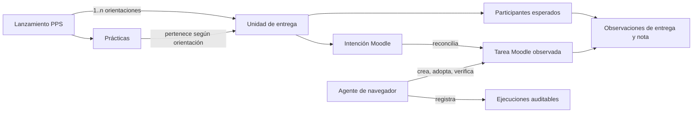
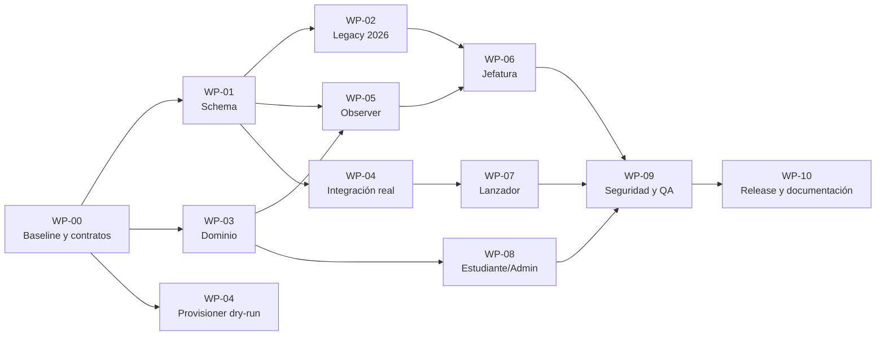

# Plan técnico · Automatización de informes PPS y tareas Moodle v2

**Estado:** ejecución parcial; fundación productiva aplicada y agente escritor pendiente
**Fecha de decisión:** 20 de agosto de 2026
**Horizonte de adopción:** convivencia controlada durante 2026 y corte limpio para nuevos lanzamientos 2027
**Alcance:** modelo de datos, agente de navegador, integración Moodle, estados académicos, vistas de estudiante/admin/jefe, observabilidad, seguridad, migración y documentación

### Checkpoint verificable · 20 de agosto de 2026

- Supabase productivo ya contiene las intenciones, el padrón esperado, leases,
  auditoría, RLS, RPC y triggers de reconciliación.
- El backfill exacto creó **212 intenciones** y **1.409 participantes**; no produjo
  cruces de orientación ni asignaciones ambiguas. Tres prácticas históricas
  contradictorias quedaron deliberadamente para revisión manual.
- Jefatura conserva el alcance anual completo de la orientación, pero el puente
  ya no solicita las 13 tareas de una vez: ejecuta lotes secuenciales de 4,
  persiste cada resultado válido y marca una corrida incompleta como parcial.
- El dominio de estados, escalas y planificación está probado y el Lanzador ya
  consume el resumen canónico por unidad.
- **Todavía no existe un worker conectado que cree o modifique tareas Moodle.**
  Los leases, la confirmación fail-closed y el planner son la base segura para
  construirlo; no habilitan escrituras por sí solos.
- No existen aún las feature flags propuestas en la sección 17. Deben
  implementarse antes de un piloto de escritura, no simularse desde el frontend.

## 1. Decisión ejecutiva

No se recomienda pausar el diseño y la construcción hasta 2027. Sí se recomienda **pausar una migración masiva o destructiva de las tareas 2026**.

La estrategia profesional es:

1. construir durante 2026 el modelo nuevo, la automatización, las vistas derivadas, la auditoría y los mecanismos de recuperación;
2. mantener las tareas 2026 ya utilizadas en modo `legacy_shared`, sin dividirlas, recrearlas ni cambiarles retrospectivamente el significado;
3. permitir, como máximo, un piloto opt-in con lanzamientos nuevos de 2026 que todavía no tengan entregas ni una tarea Moodle comprometida;
4. exigir el modo `dedicated` para toda PPS nueva de 2027: una unidad de entrega y una tarea Moodle exclusiva por lanzamiento y orientación;
5. retirar el flujo manual del Lanzador únicamente cuando la automatización haya superado los criterios de aceptación y exista una vía administrativa de recuperación.

Esto evita dos extremos inconvenientes: seguir acumulando deuda durante varios meses o intentar “ordenar” retrospectivamente tareas compartidas que ya contienen entregas y calificaciones reales.

### 1.1 Respuesta corta a la convivencia con 2026

Sí pueden convivir ambos modelos. La compatibilidad debe ser explícita:

| Modo            | Casos                                              | Identidad de la tarea                      | Escaneo                                                                  | Escrituras automáticas en Moodle                   |
| --------------- | -------------------------------------------------- | ------------------------------------------ | ------------------------------------------------------------------------ | -------------------------------------------------- |
| `legacy_shared` | Tareas 2024–2026 reutilizadas entre relanzamientos | vínculo observado existente                | por `cmid`, año y orientación; luego se filtra por participante esperado | no, salvo corrección manual autorizada             |
| `dedicated`     | piloto seguro y todos los lanzamientos nuevos 2027 | clave estable de lanzamiento + orientación | sólo la tarea exacta y su padrón esperado                                | sí, mediante reconciliación idempotente del agente |

La vista de jefes, la del estudiante y la del administrador deben consumir un **modelo canónico común** que oculte esta diferencia operativa. La interfaz puede mostrar una insignia de trazabilidad (`Histórica compartida` o `Tarea exclusiva`), pero los estados y conteos deben significar lo mismo.

## 2. Diagnóstico y restricciones actuales

### 2.1 Problema funcional

Hoy se mezclan tres hechos que no representan la misma etapa:

- la PPS llegó a su fecha de finalización;
- el estudiante entregó o no entregó el informe;
- el informe fue corregido, aprobado, observado o desaprobado.

Como consecuencia, una práctica puede aparecer como `Finalizada` por calendario aunque el informe todavía esté pendiente. Al mismo tiempo, la vista del jefe depende de una sincronización amplia de Moodle que puede exceder el tiempo disponible y dejar datos viejos o incompletos.

### 2.2 Hechos verificados en la implementación vigente

- `practicas.estado` tiene semántica operativa y actualmente puede pasar a `Finalizada` por calendario. También participa en reglas de reinscripción. Cambiarle el significado rompería otros flujos.
- `aula_entregas` cataloga tareas observadas en Moodle.
- `lanzamiento_moodle_tareas` exige que la tarea Moodle ya exista y vincula un lanzamiento con una tarea por orientación. No representa una tarea que todavía debe crearse.
- el estado de escaneo se cierra hoy al detectar una calificación, pero una calificación no implica necesariamente aprobación definitiva;
- el puente del navegador admite como máximo 20 tareas por solicitud. La solución debe conservar lotes aunque el volumen habitual sea menor;
- en 2026 existen 49 vínculos confirmados lanzamiento–orientación y una reutilización significativa de tareas: Clínica tiene 22 vínculos con 12 tareas, Comunitaria 8 con 5, Educacional 8 con 5 y Laboral 11 con 7;
- existen lanzamientos con dos orientaciones. Por eso la unidad técnica correcta no es simplemente “una tarea por lanzamiento”, sino **una tarea por lanzamiento y orientación**;
- hay prácticas históricas finalizadas con informe nulo, entregado, sin entrega o calificado. No es seguro reinterpretarlas masivamente sin evidencia adicional.

### 2.3 Principio de compatibilidad

El sistema nuevo debe ser aditivo al principio:

- no reescribir la historia;
- no inferir aprobaciones que no estén respaldadas por una observación o acción explícita;
- no depender del texto visible del nombre de una tarea como identificador;
- no hacer que la acreditación completa falle porque Moodle estuvo lento;
- no permitir que una sincronización parcial se presente como información actualizada.

## 3. Modelo conceptual canónico

El rediseño separa objetos que hoy están implícitamente combinados.

### 3.1 Objetos del dominio

#### Lanzamiento PPS

La oferta administrativa que atraviesa el pipeline del Lanzador: borrador, selección, seguro, confirmación, activa y archivada.

#### Práctica

La participación concreta de un estudiante en un lanzamiento. Conserva su estado operativo actual y sigue siendo la base de reglas como reinscripción, baja o práctica no concretada.

#### Unidad de entrega

La cohorte responsable de entregar un mismo informe en una misma actividad Moodle. Su identidad canónica es:

```text
(lanzamiento_id, orientacion_key)
```

Una PPS de una sola orientación tendrá una unidad. Un lanzamiento que abarca dos orientaciones tendrá dos unidades, porque cada jefe debe controlar solamente su área y Moodle puede requerir tareas diferentes.

#### Intención de tarea Moodle

La especificación deseada de una tarea, exista o no todavía en Moodle. Es declarativa: define nombre, descripción, fechas, configuración, visibilidad y padrón. La base de datos expresa “qué debería existir”; el agente se ocupa de reconciliar Moodle con esa intención.

#### Tarea Moodle observada

La actividad real de Moodle identificada por `course_id` y `cmid`/`moodle_id`, registrada en `aula_entregas`. Es evidencia externa, no la definición del negocio.

#### Participante esperado

Una práctica/estudiante que debe resolver el informe de una unidad de entrega. Este padrón determina los denominadores: cuántos deben entregar, cuántos faltan y cuándo puede considerarse resuelta la tarea.

#### Observación de informe

Un hecho importado desde Moodle: sin entrega, borrador, entregado, fecha real de entrega, calificación, devolución, reapertura o intento. Las observaciones deben conservar trazabilidad de origen y fecha.

#### Ejecución del agente

Una corrida auditable del agente de navegador, con pasos, resultado, errores, tiempos y cambios observados.

### 3.2 Relaciones



### 3.3 Invariantes no negociables

1. Sólo puede haber una intención activa por `(lanzamiento_id, orientacion_key)`.
2. Una intención `dedicated` sólo puede quedar `verified` si tiene un `cmid` único y se releyó su configuración real.
3. La cantidad esperada se deriva de participantes; nunca se guarda como un contador manual independiente.
4. Un estudiante retirado o reemplazado conserva historial, pero deja de contar como pendiente desde la fecha efectiva correspondiente.
5. `Finalizada` académicamente significa que la práctica terminó y el informe quedó aprobado o fue resuelto por una excepción explícita válida.
6. “Tiene nota” y “está aprobado” no son equivalentes.
7. Una tarea no se considera resuelta hasta que todos los participantes esperados activos tengan un resultado terminal.
8. Moodle no es la única fuente de verdad: aporta evidencia de entrega/calificación; la pertenencia a la cohorte y las excepciones administrativas pertenecen a Mi Panel.
9. El agente nunca decide a qué lanzamiento corresponde una tarea únicamente por similitud de nombre.
10. Toda operación de creación o modificación debe poder repetirse sin producir duplicados.

## 4. Estados: separar ejes en lugar de crear un enum gigante

### 4.1 Estado operativo de la práctica

Se conserva `practicas.estado` y sus reglas vigentes. Representa si la experiencia se encuentra en curso, terminó por calendario, fue desaprobada institucionalmente o no se concretó. No debe reutilizarse para modelar todo el ciclo del informe.

### 4.2 Estado individual del informe

Se propone un estado canónico derivado, no una edición directa de `practicas.estado`:

| Estado                | Significado                                                  |
| --------------------- | ------------------------------------------------------------ |
| `not_applicable`      | la práctica no requiere informe por una excepción respaldada |
| `unlinked_legacy`     | caso histórico sin vínculo suficiente para afirmar su estado |
| `not_open`            | la tarea existe pero todavía no abrió                        |
| `awaiting_submission` | abrió y no existe una entrega válida                         |
| `under_review`        | se entregó y no existe una resolución final                  |
| `revision_required`   | fue corregido y requiere una nueva entrega                   |
| `passed`              | aprobado de forma verificable                                |
| `failed_final`        | desaprobado definitivo mediante regla o acción explícita     |
| `waived`              | obligación cerrada por excepción administrativa auditada     |
| `unknown`             | Moodle respondió de forma incompleta o ambigua               |

Regla recomendada para una nota insuficiente: la primera corrección no aprobatoria debe producir `revision_required`; `failed_final` requiere una acción explícita o una regla institucional formal sobre cantidad de intentos. No debe inferirse automáticamente sólo porque hay una nota.

### 4.3 Estado académico mostrado al usuario

Es una proyección de práctica + informe:

| Condición                                                 | Estado presentado      |
| --------------------------------------------------------- | ---------------------- |
| la práctica todavía no llegó a su fecha de finalización   | `En curso`             |
| terminó y el informe no fue entregado                     | `Informe pendiente`    |
| existe una entrega sin resolución                         | `En corrección`        |
| existe devolución no terminal                             | `Reentrega solicitada` |
| práctica terminada + informe aprobado o excepción válida  | `Finalizada`           |
| práctica/informe con desaprobación definitiva             | `Desaprobada`          |
| evidencia histórica insuficiente o sincronización ambigua | `Por verificar`        |

Este estado debe provenir de una vista/RPC común. No se implementarán reglas distintas en la tabla del estudiante, el panel del jefe y el detalle administrativo.

### 4.4 Estado de aprovisionamiento de la tarea

```text
pending → claimed → reconciling → verified
                       ├→ needs_attention
                       └→ error → pending/retry

pending/verified → disabled o cancelled (acción explícita)
```

`verified` implica que el agente volvió a abrir la actividad y comprobó sus campos críticos. “Se hizo clic en Guardar” no alcanza.

### 4.5 Estado de monitoreo

```text
not_started → hot → cold → settled
                  ↘ needs_attention
```

- `hot`: debe observarse frecuentemente;
- `cold`: sólo quedan participantes sin entrega y la fecha de vencimiento más la gracia ya pasó;
- `settled`: todos los participantes están resueltos;
- `needs_attention`: hay datos ambiguos, errores reiterados o deriva de configuración.

## 5. Política temporal

Las fechas deben calcularse en `America/Argentina/Buenos_Aires` y persistirse como instantes UTC, conservando la zona de negocio en la documentación y en las pruebas.

Valores iniciales recomendados:

- `open_at`: 7 días antes de la fecha final de la PPS;
- `submission_due_at`: 30 días después de la fecha final de la PPS;
- hora de vencimiento: 23:59 de Argentina en la fecha calculada;
- `cutoff_at`: nulo, para permitir entregas tardías;
- fecha límite de corrección/SLA: 30 días corridos desde `submitted_at` real, no desde la fecha de la PPS ni desde la apertura de la tarea.

Es importante no usar “apertura + 30 días”: eso dejaría sólo 23 días posteriores a la finalización de la práctica.

En Moodle:

- **Allow submissions from** representa `open_at`;
- **Due date** marca la entrega tardía pero no impide entregar;
- **Cut-off date** debe quedar deshabilitada si el criterio institucional permite entregas fuera de término.

Referencias: [Assignment settings](https://docs.moodle.org/502/en/mod/assignment/mod) y [Common module settings](https://docs.moodle.org/502/en/Common_module_settings).

## 6. Diseño de datos

Los nombres definitivos se validarán contra las convenciones del schema, pero la estructura requerida es la siguiente.

### 6.1 Nueva tabla `moodle_task_intents`

Representa la configuración deseada antes y después de que exista la actividad real.

Campos mínimos:

| Campo                                      | Propósito                                                               |
| ------------------------------------------ | ----------------------------------------------------------------------- |
| `id uuid`                                  | identidad interna                                                       |
| `lanzamiento_id`                           | lanzamiento propietario                                                 |
| `orientacion_key`                          | orientación normalizada                                                 |
| `mode`                                     | `legacy_shared` o `dedicated`                                           |
| `stable_key`                               | identificador externo inmutable, por ejemplo `PPS:<uuid>:<orientacion>` |
| `desired_name`                             | nombre canónico legible                                                 |
| `description_template_version`             | versión de plantilla utilizada                                          |
| `desired_description_html`                 | descripción esperada sanitizada                                         |
| `desired_open_at`                          | apertura                                                                |
| `desired_due_at`                           | vencimiento no bloqueante                                               |
| `desired_cutoff_at`                        | normalmente nulo                                                        |
| `desired_grade_mode` / `desired_grade_max` | configuración de nota                                                   |
| `desired_section_key`                      | ubicación organizativa esperada                                         |
| `desired_visibility`                       | visibilidad                                                             |
| `provisioning_status`                      | ciclo de creación/reconciliación                                        |
| `monitoring_status`                        | ciclo de observación                                                    |
| `next_reconcile_at`                        | próxima oportunidad de escritura/verificación                           |
| `next_scan_at`                             | próxima lectura de entregas                                             |
| `attempt_count`                            | intentos consecutivos fallidos                                          |
| `last_error_code` / `last_error_message`   | diagnóstico estructurado y sanitizado                                   |
| `last_attempt_at` / `last_verified_at`     | frescura                                                                |
| `desired_config_hash`                      | huella de la configuración esperada                                     |
| `observed_config_hash`                     | huella de lo observado                                                  |
| `aula_entrega_id`                          | vínculo confirmado, inicialmente nulo                                   |
| `created_at` / `updated_at`                | auditoría básica                                                        |

Restricciones e índices:

- `UNIQUE (lanzamiento_id, orientacion_key)` para intenciones activas;
- `UNIQUE (stable_key)`;
- índice parcial de trabajos vencidos por `next_reconcile_at` y estado;
- índice parcial de escaneos vencidos por `next_scan_at` y estado;
- FK a `aula_entregas` sólo después de verificar la tarea real;
- checks de coherencia de fechas y modos.

Se recomienda una tabla nueva en vez de volver nullable de inmediato `lanzamiento_moodle_tareas.aula_entrega_id`. Esto mantiene estable el camino de lectura actual y reduce el riesgo de introducir vínculos incompletos donde hoy se asumen vínculos confirmados.

### 6.2 Nueva tabla `moodle_task_expected_participants`

Representa el padrón y su historia.

Campos mínimos:

| Campo                         | Propósito                                                           |
| ----------------------------- | ------------------------------------------------------------------- |
| `id uuid`                     | identidad                                                           |
| `intent_id`                   | unidad/tarea esperada                                               |
| `practica_id`                 | práctica concreta                                                   |
| `estudiante_id`               | estudiante                                                          |
| `membership_status`           | `expected`, `withdrawn`, `institution_failed`, `waived`, `replaced` |
| `active_from` / `active_to`   | vigencia histórica                                                  |
| `source`                      | selección, reemplazo, backfill o acción manual                      |
| `reason_code` / `reason_note` | motivo de excepción                                                 |
| `replaces_participant_id`     | trazabilidad de reemplazos                                          |
| `created_by`                  | actor o ejecución                                                   |
| `created_at` / `updated_at`   | auditoría                                                           |

Reglas:

- no borrar participantes que entregaron, fueron reemplazados o retirados;
- impedir duplicados activos para la misma práctica e intención;
- una baja cambia la membresía, no borra evidencia;
- el denominador operativo considera sólo participantes activos con obligación;
- una excepción manual requiere motivo y actor.

### 6.3 Tablas actuales que se conservan

#### `aula_entregas`

Continúa siendo el catálogo de actividades Moodle observadas. Debe incorporar, si todavía no existen, metadatos de verificación como clave estable observada, hash, última lectura y curso.

#### `lanzamiento_moodle_tareas`

Continúa como vínculo confirmado entre lanzamiento, orientación y tarea real. Una intención `dedicated` sólo lo completa después de verificar el `cmid`. Los vínculos históricos se adoptan como `legacy_shared` sin recrear actividades.

#### Observaciones y snapshots de calificación

Se conservan las observaciones crudas y el mecanismo vigente de reapertura. La evolución debe distinguir explícitamente:

- existencia de una nota;
- resultado aprobado/no aprobado;
- necesidad de reentrega;
- resolución definitiva;
- fuente y momento de cada cambio.

No se debe usar `task_status = graded` como sinónimo de “participante resuelto”.

### 6.4 Auditoría privada del agente

Crear tablas en schema `private`:

#### `private.moodle_agent_runs`

- tipo de trabajo (`provision`, `observe`, `repair_drift`, `adopt_legacy`);
- versión del agente y de la plantilla;
- inicio, fin, resultado;
- cantidades procesadas, verificadas, omitidas y fallidas;
- identificador del actor/sesión sin guardar secretos;
- error general sanitizado.

#### `private.moodle_agent_run_items`

- ejecución e intención afectada;
- paso (`claim`, `find`, `create`, `configure`, `verify`, `persist`, `scan`);
- resultado y duración;
- `cmid` observado;
- hashes antes/después;
- código de error;
- evidencia estructurada mínima.

No guardar capturas con información estudiantil salvo necesidad operativa excepcional y política explícita de retención.

### 6.5 Vistas y RPC canónicas

Crear, como mínimo:

- vista/RPC de estado individual del informe;
- resumen por unidad: esperados, entregados, faltantes, en corrección, con reentrega, aprobados y resueltos;
- cola de tareas para jefe por orientación y urgencia;
- snapshot de salud de automatización;
- RPC para crear/reconciliar intenciones faltantes de forma idempotente;
- RPC para reclamar trabajos vencidos mediante lease;
- RPC para confirmar una tarea observada sólo después de la verificación;
- RPC administrativa para excepciones, reaperturas y reintentos.

Las vistas expuestas deben usar `security_invoker=true` cuando corresponda. Las funciones `SECURITY DEFINER` deben ser mínimas, fijar `search_path`, validar rol y argumentos, y evitar exponer helpers privados directamente.

## 7. Generación del padrón y de la intención

### 7.1 Momento de creación

La intención no debe depender únicamente de que el administrador pulse un botón concreto. Debe derivarse de condiciones declarativas:

- el lanzamiento tiene al menos una práctica/seleccionado vigente;
- existe orientación válida;
- existe fecha final válida;
- el lanzamiento llegó a confirmación/activación o a la condición institucional acordada;
- no existe ya una intención activa para esa unidad.

Una función de reconciliación periódica debe crear cualquier intención faltante. Así, si la automatización de acreditación se interrumpe después de crear las prácticas, el sistema se repara solo en la siguiente ejecución.

### 7.2 Integración con la rutina de acreditación

La rutina del otro agente puede ampliarse, pero Moodle no debe quedar dentro de la transacción crítica de acreditación:

1. acreditar/seleccionar estudiantes y crear las prácticas en Mi Panel;
2. crear o actualizar en la misma base la intención y su padrón;
3. confirmar la transacción de negocio;
4. dejar el trabajo Moodle pendiente en la cola;
5. el aprovisionador lo reclama, crea/adopta/verifica la tarea y registra el resultado;
6. si Moodle falla, la acreditación sigue válida y el trabajo se reintenta.

Este patrón evita que un timeout del campus deje una selección a medias o fuerce al agente a repetir acciones sobre estudiantes.

### 7.3 Congelamiento y cambios del padrón

- la primera versión del padrón se forma al activar/cerrar la cohorte seleccionada;
- los reemplazos agregan una nueva membresía y cierran la anterior;
- las bajas preservan historial y dejan de contar desde su vigencia;
- una nueva incorporación se agrega a la misma unidad si corresponde a la misma PPS y orientación;
- si una práctica cambia de orientación, se registra un movimiento entre unidades; no se edita silenciosamente la historia;
- las observaciones de un participante retirado no se eliminan.

## 8. Agente de aprovisionamiento Moodle

### 8.1 Separación de responsabilidades

Aunque ambos trabajos puedan usar la misma sesión de navegador, deben existir como jobs independientes:

1. `moodle_task_provisioner`: crea, adopta, configura y verifica actividades;
2. `moodle_task_observer`: lee entregas, fechas reales, calificaciones y devoluciones.

Un fallo en acreditación o aprovisionamiento no debe impedir la actualización de informes ya existentes.

### 8.2 Identidad estable

Usar el campo nativo **ID number** de la actividad Moodle con `stable_key`, por ejemplo:

```text
PPS:<lanzamiento_uuid>:<orientacion_key>
```

El nombre visible debe ser profesional y legible, pero puede cambiar. El identificador estable no.

La adopción de una actividad existente puede usar coincidencia exacta controlada de nombre/curso sólo una vez y debe terminar registrando/verificando su `cmid`. Una coincidencia aproximada nunca autoriza una modificación automática.

### 8.3 Creación por plantilla

Se recomienda duplicar una actividad modelo oculta y validada en lugar de construir cada opción desde cero. La plantilla debe fijar:

- tipo de entrega y archivos permitidos;
- tamaño y cantidad de archivos;
- escala/nota máxima;
- intentos y política de reentrega;
- comentarios y retroalimentación;
- notificaciones;
- finalización de actividad;
- visibilidad inicial;
- restricciones base.

El agente modifica solamente:

- clave estable;
- nombre y descripción;
- apertura, vencimiento y ausencia de corte;
- sección/organización;
- grupo o agrupamiento si esa fase está habilitada;
- visibilidad final.

### 8.4 Reconciliación idempotente

Algoritmo obligatorio:

1. reclamar una intención con un lease temporal;
2. buscar en el curso una actividad con la clave estable;
3. si existe una única, adoptarla;
4. si no existe, duplicar la plantilla y configurarla;
5. si existen varias, no elegir una: marcar `needs_attention`;
6. guardar;
7. volver a abrir la configuración;
8. verificar clave, nombre, fechas, corte, nota, sección y visibilidad;
9. calcular el hash observado;
10. sólo entonces registrar `aula_entrega_id`, confirmar el vínculo y marcar `verified`;
11. liberar el lease y programar el primer escaneo.

Si el agente se cae después de crear en Moodle pero antes de confirmar en Supabase, la próxima ejecución encuentra la misma clave y adopta la tarea. No crea una segunda.

### 8.5 Deriva de configuración

Un cambio de fecha final, plantilla o política cambia `desired_config_hash`. El agente compara el hash deseado con el observado:

- si coinciden, no escribe;
- si difieren en campos permitidos, corrige y verifica;
- si difieren en un campo sensible después de haber entregas, marca `needs_attention` en vez de sobrescribir;
- registra antes/después y actor.

### 8.6 Organización y visibilidad en Moodle

No conviene crear una sección de curso completa por cada PPS: escalaría mal y haría difícil navegar. La recomendación inicial es:

- organizar actividades por año y orientación;
- usar nombres canónicos claros;
- personalizar el acceso principalmente desde Mi Panel;
- evaluar grupos/agrupamientos por unidad de entrega para restringir quién ve cada actividad.

Los grupos son la opción más prolija para el estudiante, pero agregan operaciones de navegador y puntos de fallo. Deben implementarse como una fase posterior al aprovisionamiento básico, no como requisito del primer piloto. El padrón interno seguirá siendo obligatorio aunque Moodle muestre más usuarios, porque determina los conteos válidos.

Una tarea resuelta no debe ocultarse al estudiante: contiene su nota y devolución. Puede moverse a una sección anual de archivo o quedar visualmente cerrada en Mi Panel.

## 9. Agente de observación y estrategia de escaneo

### 9.1 La cantidad de tareas no es el único problema

Moodle puede procesar 13 tareas, pero no es profesional depender de que siempre respondan dentro de un único timeout. La duración cambia según cantidad de participantes, carga del campus, sesión y peso de la página de calificación. El puente actual admite como máximo 20 tareas por solicitud y ese límite debe mantenerse como guardrail.

La solución es una cola incremental, no una consulta monolítica disparada por la entrada del jefe.

### 9.2 Lotes y concurrencia

Valores iniciales recomendados:

- lote de 5 a 10 tareas;
- concurrencia máxima 2;
- timeout por tarea/página, no sólo uno global;
- checkpoint después de cada tarea;
- reintento con backoff y jitter;
- corte del circuito ante expiración de sesión o cambio de DOM;
- botón `Sincronizar ahora` que encola trabajo, no bloquea toda la pantalla.

### 9.3 Política hot/cold

Una intención entra en `hot` al llegar a `open_at`.

Debe seguir en `hot` cuando:

- está dentro de la ventana de entrega;
- existe al menos una entrega sin resolución;
- existe una reentrega pendiente;
- una observación fue reabierta;
- hay ambigüedad que requiere una nueva lectura.

Puede pasar a `cold` cuando todos los no resueltos nunca entregaron y ya venció `due_at` más un período de gracia configurable. En `cold` se escanea semanalmente o bajo demanda.

Pasa a `settled` sólo si cada participante esperado activo terminó en uno de estos resultados:

- `passed`;
- `failed_final`;
- `waived`;
- retirado/reemplazado sin obligación vigente.

Una tarea con todos calificados pero alguno en `revision_required` no está resuelta.

### 9.4 Prioridad de la cola

Orden sugerido:

1. tareas con entregas pendientes de calificación cerca o fuera del SLA;
2. tareas con reentregas;
3. tareas `hot` sin escaneo en las últimas 24 horas;
4. tareas abiertas con faltantes;
5. tareas `cold`;
6. verificaciones históricas bajo demanda.

### 9.5 Ingesta y matching

- preferir identificadores institucionales estables, especialmente DNI normalizado y usuario Moodle verificado;
- registrar filas ambiguas o no emparejadas;
- no aplicar una nota si existen dos candidatos;
- deduplicar observaciones repetidas;
- preservar `submitted_at` real de Moodle;
- filtrar los resultados por el padrón esperado, no por todas las personas visibles en la página de calificación.

## 10. Convivencia y migración 2026 → 2027

### 10.1 Lo que no se hará con las tareas 2026

- no dividir tareas compartidas que ya tienen entregas;
- no mover entregas entre actividades;
- no cambiar retroactivamente fechas o escalas;
- no renombrar masivamente tareas para simular el modelo nuevo;
- no declarar “aprobado” todo lo que simplemente tenga una nota;
- no cerrar como resuelta una tarea compartida por mirar sólo uno de sus relanzamientos;
- no borrar vínculos históricos aunque sean imperfectos.

### 10.2 Adopción de históricos

Crear intenciones `legacy_shared` a partir de los vínculos confirmados existentes:

- una intención por `(lanzamiento, orientación)`;
- varias intenciones legacy pueden apuntar al mismo `aula_entrega_id`/`cmid`;
- cada intención conserva su propio padrón esperado;
- el observador lee el `cmid` una sola vez por corrida y distribuye las observaciones entre las unidades vinculadas;
- una actividad compartida sólo deja de necesitar escaneo frecuente cuando todas las unidades vinculadas están resueltas o frías;
- los casos sin vínculo o sin evidencia suficiente quedan `unlinked_legacy`/`Por verificar`, no se inventan.

### 10.3 Lectura híbrida para jefes

Durante 2026:

- para `legacy_shared`, la cola puede descubrir las tareas del año y orientación, pero debe deduplicarlas por `cmid` antes de navegar;
- para `dedicated`, sólo consulta la tarea exacta de cada intención;
- entrar a la vista del jefe puede pedir frescura, pero no debe iniciar obligatoriamente una sincronización completa ni bloquear el contenido;
- se muestran los últimos datos confirmados junto con `Actualizado hace…`, el progreso de la cola y errores parciales;
- los resultados de un lote exitoso se conservan aunque otro lote falle.

### 10.4 Piloto opcional durante 2026

Un lanzamiento puede entrar al piloto `dedicated` sólo si:

- es nuevo y todavía no tiene entregas;
- no existe una tarea compartida comprometida para esa cohorte;
- su orientación y fecha final son válidas;
- el padrón fue reconciliado;
- existe plantilla Moodle validada;
- hay rollback administrativo;
- coordinación acepta expresamente el piloto.

El piloto debe limitarse inicialmente a una o dos unidades de entrega y completar al menos un ciclo de creación, entrega de prueba, observación, nota, reapertura y reconciliación.

### 10.5 Corte 2027

Para lanzamientos con inicio 2027:

- `dedicated` es el valor por defecto y luego obligatorio;
- el Lanzador crea la intención automáticamente;
- no se permite reutilizar un `cmid` de otro lanzamiento/orientación;
- el campo manual de tarea desaparece del flujo normal;
- la excepción manual exige permiso, motivo y auditoría;
- los vínculos 2026 permanecen legibles en modo legacy.

### 10.6 Criterio para retirar el escaneo anual amplio

No se retira por fecha arbitraria. Se retira por datos:

- 100 % de lanzamientos nuevos bajo `dedicated`;
- cero unidades activas sin intención;
- cero tareas dedicated compartidas accidentalmente;
- sincronización dentro del SLO durante al menos cuatro semanas;
- todos los históricos activos resueltos o clasificados como `cold`/excepción;
- runbook y recuperación manual probados.

### 10.7 Contrato operativo de convivencia 2026

El año del lanzamiento define la política por defecto; no la fecha en la que una IA ejecuta la migración:

```text
fecha_inicio < 2027-01-01  → legacy_shared, salvo piloto explícito
fecha_inicio >= 2027-01-01 → dedicated obligatorio
```

Así, una PPS 2027 preparada durante diciembre de 2026 nace bajo el modelo nuevo. Una PPS 2026 que continúa siendo corregida en 2027 conserva su identidad histórica y no se transforma silenciosamente.

Para cada actividad compartida 2026 se aplica este flujo:

1. resolver el `cmid` confirmado y todas las unidades `(lanzamiento, orientación)` que lo referencian;
2. unir los padrones esperados vigentes de esas unidades;
3. consultar el `cmid` una sola vez en Moodle;
4. emparejar cada fila por identidad institucional verificada;
5. distribuir la observación a la práctica y unidad correctas;
6. calcular estados y conteos por unidad, nunca usando el total bruto de usuarios de Moodle;
7. conservar filas ambiguas en una bandeja de reconciliación;
8. programar el próximo escaneo según el conjunto de unidades vinculadas.

La frecuencia del `cmid` compartido se determina por la unidad más activa: si una cohorte está `settled` pero otra todavía tiene una entrega en corrección, la actividad continúa `hot`. Esto evita cerrar el escaneo por haber terminado solamente uno de los relanzamientos.

### 10.8 Matriz de decisión para casos 2026

| Caso observado                                                 | Tratamiento                                                                 | ¿Se crea otra tarea?                   | Estado visible si falta evidencia                |
| -------------------------------------------------------------- | --------------------------------------------------------------------------- | -------------------------------------- | ------------------------------------------------ |
| tarea reutilizada con entregas o notas                         | adoptar como `legacy_shared`; preservar vínculos y observaciones            | no                                     | `Por verificar` sólo para participantes ambiguos |
| tarea vinculada sin entregas, pero ya comunicada a estudiantes | mantener legacy para no cambiar el destino esperado                         | no                                     | último snapshot + frescura                       |
| lanzamiento nuevo 2026 todavía sin tarea ni entregas           | legacy por defecto; `dedicated` sólo como piloto aprobado                   | opcional en piloto                     | `Pendiente de configuración` para admin          |
| lanzamiento con dos orientaciones                              | crear dos unidades; cada una tiene su padrón y estado                       | sólo en dedicated, una por orientación | estado separado por orientación                  |
| dos unidades apuntan al mismo `cmid`                           | permitido únicamente en `legacy_shared`                                     | no                                     | alerta si el modo no coincide                    |
| vínculo inexistente o contradictorio                           | no adivinar; llevar a reconciliación manual                                 | no hasta resolver                      | `Por verificar`                                  |
| estudiante reemplazado o retirado                              | cerrar su membresía con motivo; conservar observaciones                     | no                                     | no cuenta como pendiente desde la vigencia       |
| entrega 2026 corregida en 2027                                 | continuar observando la misma tarea legacy                                  | no                                     | estado según la evidencia real                   |
| fecha final corregida después de comunicar la tarea            | no modificar automáticamente una tarea con entregas                         | no                                     | `Requiere atención` para decisión humana         |
| tarea calificada con nota insuficiente                         | mantenerla activa como `revision_required` salvo resolución final explícita | no                                     | `Reentrega solicitada`                           |

### 10.9 Qué ve cada rol durante la convivencia

- **Estudiante:** un único estado académico coherente y el enlace que realmente le corresponde. No necesita entender los modos técnicos.
- **Jefe:** unidades de su orientación, conteos calculados desde el padrón y frescura. Puede ver `Histórica compartida` como dato de trazabilidad.
- **Admin:** modo, vínculo, padrón, errores, excepciones y acciones de recuperación.
- **Directivo:** agregados reconciliados; `Por verificar` se informa por separado y nunca se suma silenciosamente a finalizados.
- **Agente:** recibe trabajos con modo explícito. En legacy sólo observa/adopta; en dedicated puede crear y reconciliar.

### 10.10 Condiciones para que 2026 no contamine 2027

- ninguna tarea `dedicated` puede compartir `cmid` con otra unidad;
- ningún vínculo legacy se usa como plantilla viva: la plantilla Moodle tiene identidad propia y permanece oculta;
- los jobs reciben `mode` desde la base, no lo infieren del nombre ni del año visible en Moodle;
- los reportes permiten filtrar y comparar ambos modos;
- los tests contienen fixtures legacy compartidos y dedicated exclusivos;
- el corte no elimina datos, funciones ni vistas legacy mientras existan casos sin resolver;
- cualquier excepción 2027 que vuelva a compartir una tarea requiere autorización, motivo y alerta de deuda, no un cambio silencioso de modo.

## 11. Cambios en producto e interfaz

### 11.1 Lanzador

Agregar una tarjeta de automatización por orientación con:

- estado: Pendiente, Creando, Verificada, Desactualizada, Requiere atención o Deshabilitada;
- tarea/`cmid` confirmada en modo sólo lectura;
- padrón esperado y última reconciliación;
- fechas calculadas;
- acciones autorizadas: reintentar, inspeccionar, adoptar tarea, registrar excepción y deshabilitar;
- explicación del error sin mostrar secretos ni trazas técnicas innecesarias.

El selector manual de tarea del Campus se mantiene temporalmente como recuperación. Se oculta del camino principal sólo después del piloto y se elimina cuando el corte 2027 sea estable.

Los componentes dentro de `LanzadorView` deben seguir usando clases `.lv4-*` para estilos visuales, de acuerdo con `AGENTS.md`.

### 11.2 Vista del jefe

La vista debe priorizar unidades y participantes, no páginas de Moodle:

- conteo esperado;
- entregados;
- faltantes;
- en corrección;
- SLA restante o vencido desde la entrega real;
- reentregas;
- aprobados y resoluciones terminales;
- frescura de cada tarea;
- expansión a la lista de estudiantes;
- filtro de críticos, esta semana, en plazo, sin fecha verificable y con error de sincronización.

Orden recomendado:

1. correcciones con SLA vencido;
2. correcciones próximas a vencer;
3. reentregas recibidas;
4. resto de entregas en revisión;
5. faltantes de entrega, como seguimiento separado.

La pantalla debe cargar el último snapshot inmediatamente. Una actualización en segundo plano no puede vaciar los datos ni reemplazarlos por un error global. Los errores deben ser por lote/tarea y permitir reintento.

Archivos actuales que probablemente se verán afectados:

- `src/views/JefeView.tsx`;
- `src/features/jefe/JefeDashboardPanels.tsx`;
- `src/features/jefe/jefeService.ts`;
- `src/features/jefe/useJefeMoodleSync.ts`;
- `src/contexts/MoodleGradeSyncContext.tsx`;
- `src/lib/moodleBridge.ts`.

### 11.3 Vista del estudiante

Después de la fecha final, la práctica debe mostrar:

- `Informe pendiente`, `En corrección`, `Reentrega solicitada`, `Finalizada` o `Por verificar`;
- acceso directo a su actividad;
- fecha de apertura y vencimiento;
- indicación de entrega tardía sin bloquear el acceso;
- fecha de entrega registrada;
- disponibilidad de devolución/nota;
- mensaje claro si la sincronización todavía no pudo verificarse.

La experiencia no debe revelar el padrón ni las notas de otros estudiantes.

Por el impacto en el estudiante, es obligatorio actualizar las Preguntas Frecuentes de `src/views/student/StudentAulaView.tsx` al implementar el nuevo flujo.

### 11.4 Vista administrativa del estudiante

Debe usar el mismo estado canónico e incluir:

- evidencia de última observación;
- historial de entregas/reaperturas;
- unidad/tarea asociada;
- excepciones administrativas;
- acción manual con motivo cuando la automatización no alcanza.

## 12. Seguridad y permisos

### 12.1 Principios

- ninguna credencial Moodle ni `service_role` dentro del frontend;
- el agente opera con una cuenta Moodle específica, permisos mínimos y registro de actor;
- las tablas públicas nuevas deben tener RLS habilitado desde su creación;
- estudiante: sólo su estado y evidencia permitida;
- jefe: sólo orientaciones autorizadas;
- admin: operación y recuperación;
- directivo: agregados y lectura según contrato;
- las escrituras del agente pasan por RPC estrechas o un backend autenticado, no por acceso irrestricto.

### 12.2 Cola y exclusión mutua

Reclamar trabajos con `FOR UPDATE SKIP LOCKED`, advisory locks o lease equivalente:

- token de lease no predecible;
- `lease_expires_at`;
- renovación/heartbeat para tareas largas;
- recuperación automática de leases vencidos;
- validación de transición de estado en servidor.

Esto impide que dos agentes creen la misma tarea o escaneen/modifiquen simultáneamente una intención.

### 12.3 Datos personales y logs

- no registrar cookies, tokens, HTML completo ni credenciales;
- normalizar DNI para matching, pero limitar su exposición en logs;
- establecer retención para ejecuciones y errores;
- preservar auditoría de cambios académicos;
- cualquier corrección manual debe incluir actor, fecha y motivo.

## 13. Observabilidad y operación

### 13.1 Métricas técnicas

- intenciones pendientes y antigüedad de la más vieja;
- tasa de creación/adopción/verificación;
- tareas con deriva;
- errores por código y versión del agente;
- tiempo por tarea y por lote;
- edad del último escaneo hot/cold;
- filas ambiguas o sin matching;
- leases vencidos;
- duplicados de clave estable;
- tareas reales sin intención y viceversa.

### 13.2 Métricas de negocio

- participantes esperados;
- entregados, faltantes y entregas tardías;
- en corrección;
- correcciones dentro/fuera de SLA;
- reentregas;
- aprobados y desaprobados definitivos;
- unidades completamente resueltas;
- porcentaje de casos `Por verificar`.

Toda métrica agregada debe reconciliar con el detalle que la compone.

### 13.3 SLO iniciales sugeridos

- una intención nueva se verifica dentro de 24 horas;
- una tarea `hot` no pasa más de 24 horas sin observación exitosa;
- una entrega observada aparece en Mi Panel dentro de 24 horas;
- cero duplicados creados por reintento;
- errores parciales nunca eliminan snapshots válidos anteriores.

### 13.4 Alertas

- intención pendiente por más de 24 horas;
- tres errores consecutivos;
- cambio de DOM o sesión expirada que detiene un lote;
- tarea hot desactualizada por más de 24 horas;
- clave estable duplicada;
- diferencia entre padrón y prácticas vigentes;
- actividad dedicated vinculada a más de una unidad;
- tarea con entrega sin matching de estudiante.

## 14. Estado de implementación previo que debe reutilizarse

Este inventario evita que una IA vuelva a construir lo ya realizado por otra. Se basa en código y migraciones presentes en `main` al 20 de agosto de 2026; antes de tomar un paquete de trabajo debe volver a verificarse con `git log`, `git status`, migraciones productivas y tests.

No se atribuye autoría por conversación: una pieza se considera existente sólo por evidencia versionada y verificable.

| Capacidad                                            | Estado                               | Evidencia actual                                                                   | Qué falta para v2                                             |
| ---------------------------------------------------- | ------------------------------------ | ---------------------------------------------------------------------------------- | ------------------------------------------------------------- |
| catálogo de tareas y vínculo lanzamiento/orientación | implementado                         | `20260810170000_create_moodle_task_catalog_and_links.sql` y reparaciones 2024–2026 | agregar la intención previa a la existencia de la tarea       |
| observaciones y snapshots de notas                   | implementado                         | workflow Moodle v2 y Edge Functions de ingesta                                     | separar “calificado” de “aprobado/resuelto”                   |
| preservación y reapertura de progreso                | implementado                         | workflow de snapshots y eventos de reapertura                                      | integrarlo al nuevo estado `revision_required`/terminal       |
| panel de jefatura por área                           | implementado                         | commit `245a1f4` y `jefe_area_panel_v1`                                            | consumir la unidad/padrón canónicos                           |
| fecha real de entrega y SLA +30                      | implementado                         | `20260819230405_use_real_moodle_submission_dates_for_jefe_reports.sql`             | generalizar a todos los casos y outcomes                      |
| sincronización de tareas del año y orientación       | implementado como puente 2026        | commit `5a2609d` y migraciones `20260819232841`, `20260819234041`                  | reemplazar el escaneo monolítico por cola incremental         |
| sincronización desde simulador admin                 | implementado                         | `20260820001332_enable_jefe_moodle_sync_in_admin_preview.sql`                      | mantener el mismo contrato en v2                              |
| batches del puente                                   | implementado parcialmente            | `MoodleGradeSyncContext.tsx` divide en lotes de 20; el bridge limita a 20          | persistir checkpoints, prioridad, backoff y errores por tarea |
| seguridad de wrappers de jefatura                    | implementado                         | wrappers invoker y helpers privados                                                | auditar las RPC y tablas nuevas                               |
| estado unificado de informe                          | parcial                              | utilidades actuales de presentación de nota                                        | crear derivación canónica multirol                            |
| intenciones Moodle                                   | fundación productiva                 | `moodle_task_intents`, triggers y RPC de reconciliación                            | conectar operación real del worker                            |
| padrón esperado por unidad                           | productivo con excepciones auditadas | `moodle_task_expected_participants`; 1.409 filas de backfill                       | resolver 3 contradicciones históricas manualmente             |
| aprovisionador de tareas                             | contrato listo, writer pendiente     | planner puro, lease y confirmación fail-closed                                     | dry-run real, creación, verificación y auditoría navegador    |
| clave estable en Moodle                              | contrato implementado en Mi Panel    | `stable_key` y hash material obligatorios en confirmación                          | validar `ID number` en una plantilla/piloto Moodle            |
| modo `dedicated`                                     | schema listo                         | generación declarativa para lanzamientos 2027 activos/archivados                   | piloto operativo antes del corte                              |
| métricas de completitud por tarea                    | read model productivo                | `get_moodle_task_unit_summaries_v1` sobre padrón persistente                       | adopción completa por todas las vistas y observabilidad       |

### 14.1 Trabajo no consolidado

Los archivos modificados sin commit o migraciones sin seguimiento no se consideran baseline aunque provengan de otra IA. El agente integrador debe clasificarlos antes de comenzar:

- si pertenecen a este plan, se asignan a un paquete, se prueban y se incorporan con commit propio;
- si pertenecen a otra funcionalidad, se preservan y se excluyen del alcance;
- nunca se pisan, descartan ni incluyen “porque estaban en el worktree”.

## 15. Plan de implementación por fases

### Fase 0 · Decisiones y baseline

Entregables:

- aprobar vocabulario y estados;
- confirmar política de nota insuficiente/reentrega;
- confirmar hora y zona de vencimiento;
- inventariar vínculos 2024–2026 y etiquetar los 2026 activos;
- identificar las tareas compartidas y lanzamientos multi-orientación;
- elegir y probar una plantilla Moodle;
- capturar baseline de tiempos/errores del escáner actual;
- definir feature flags y rollback.

Criterio de salida: no quedan decisiones que cambien el schema básico y existe un dataset de reconciliación reproducible.

### Fase 1 · Fundación de base de datos

Entregables:

- migraciones de intenciones, participantes, auditoría y leases;
- backfill `legacy_shared` sin modificar tareas;
- vistas/RPC de estado y resumen;
- RLS, permisos e índices;
- pruebas SQL de contratos y reconciliación;
- regeneración de `src/types/supabase.ts` con `npm run gen-types`;
- ejecución de asesores de seguridad/performance y corrección de hallazgos.

Criterio de salida: todos los vínculos vigentes están clasificados o listados como excepción, y los agregados coinciden con el detalle.

### Fase 2 · Modelo de lectura único

Entregables:

- servicio TypeScript canónico para estados de informe;
- adaptación del panel del jefe a snapshots persistidos y errores parciales;
- presentación consistente en estudiante y admin;
- tests de matriz de estados;
- frescura visible sin bloquear la pantalla.

Criterio de salida: las tres vistas presentan el mismo estado para el mismo participante y el panel no depende de terminar un escaneo completo para cargar.

### Fase 3 · Aprovisionador en modo sombra

Entregables:

- cola, claim y auditoría;
- búsqueda por clave estable;
- duplicación de plantilla;
- verificación posguardado;
- detección de deriva;
- modo dry-run que no escribe en Moodle;
- simulación de fallos y reanudación.

Criterio de salida: el dry-run predice correctamente las acciones y repetir una ejecución no propone duplicados.

### Fase 4 · Piloto `dedicated`

Entregables:

- una o dos unidades sin entregas previas;
- creación real verificada;
- padrón esperado;
- entrega de prueba, calificación, devolución y reapertura;
- confirmación de fechas y visibilidad;
- runbook de recuperación probado.

Criterio de salida: ciclo completo exitoso, sin intervención en datos históricos y con auditoría suficiente.

### Fase 5 · Observador incremental y panel operativo

Entregables:

- lotes, prioridades hot/cold y backoff;
- deduplicación de tareas legacy por `cmid`;
- cierre por participantes resueltos;
- panel de salud;
- alertas y acción `Sincronizar ahora`;
- métricas de negocio reconciliadas.

Criterio de salida: cuatro semanas dentro de SLO y sin regresión del flujo legacy.

### Fase 6 · Corte de nuevos lanzamientos 2027

Entregables:

- `dedicated` obligatorio para nuevos lanzamientos;
- automatización integrada al flujo normal del Lanzador;
- retiro del selector manual del camino principal;
- excepción administrativa auditada;
- FAQ y manuales publicados;
- capacitación breve de coordinación y jefes.

Criterio de salida: todo lanzamiento 2027 elegible tiene intención, padrón y tarea verificada.

### Fase 7 · Reducción de legacy

Entregables:

- dejar en cold/settled tareas históricas resueltas;
- retirar consultas anuales amplias cuando se cumplan los criterios de datos;
- conservar acceso histórico de sólo lectura;
- archivar código puente que ya no tenga consumidores.

## 16. Diseño de ejecución para varias IA

### 16.1 Modelo de coordinación

La implementación se divide en paquetes con contratos explícitos. Cada paquete tiene una sola IA responsable de escritura, su propia rama/worktree y límites de archivos. Una IA integradora mantiene la secuencia, resuelve contratos compartidos y es la única autorizada a aplicar migraciones en producción.

Principios:

1. **Una IA por archivo a la vez.** Dos agentes no editan en paralelo el mismo archivo compartido.
2. **Contrato antes que consumidor.** Schema, RPC, DTO y vocabulario se congelan antes de construir UI dependiente.
3. **Commits pequeños y convencionales.** Un paquete no mezcla arreglos no relacionados.
4. **Producción tiene una sola autoridad.** Los agentes de paquete preparan y prueban; el integrador aplica DB/deploy.
5. **El trabajo previo se audita, no se rehace.** La tabla de la sección 14 es el punto inicial.
6. **Los generados tienen un dueño.** Sólo el integrador regenera `src/types/supabase.ts` al consolidar migraciones.
7. **La documentación central tiene un dueño.** Los agentes entregan notas; el integrador actualiza este plan, `AGENTS.md` e índices para evitar conflictos.

### 16.2 Artefactos de coordinación

Antes del primer paquete de implementación crear y mantener:

- `docs/moodle-v2/contracts.md`: nombres de tablas, enums, RPC, DTO, errores y feature flags congelados;
- `docs/moodle-v2/workboard.md`: estado de paquetes, responsable, rama, commit, dependencias, tests y bloqueos;
- `docs/moodle-v2/decisions.md`: ADR breves y decisiones de negocio;
- `docs/moodle-v2/fixtures/`: casos anonimizados legacy, dedicated y multi-orientación;
- `docs/moodle-v2/handoffs/`: una entrega corta por paquete terminado.

El workboard es un registro de coordinación, no una fuente de verdad técnica. La verdad sigue estando en migraciones, tipos, tests y contratos versionados.

### 16.3 Paquetes de trabajo

| Paquete                  | Responsable       | Alcance principal                                            | Dependencias                               | Archivos exclusivos sugeridos              | Entrega verificable                         | Estado                      |
| ------------------------ | ----------------- | ------------------------------------------------------------ | ------------------------------------------ | ------------------------------------------ | ------------------------------------------- | --------------------------- |
| `WP-00 Baseline`         | IA integradora    | auditar commits, worktree, DB real, fixtures y contratos     | ninguna                                    | plan, contracts, workboard                 | baseline aprobado y worktree clasificado    | **DONE**                    |
| `WP-01 Schema`           | IA DB             | intenciones, participantes, auditoría, leases, RLS e índices | WP-00                                      | nuevas migraciones y tests SQL             | migración aditiva + contratos SQL           | **DONE**                    |
| `WP-02 Legacy 2026`      | IA datos          | clasificar/backfillear legacy, padrones y excepciones        | WP-01                                      | migración/backfill y auditoría de vínculos | preview, reconciliación y rollback          | **DONE CON 3 EXCEPCIONES**  |
| `WP-03 Dominio`          | IA TypeScript     | estados canónicos y DTO puros                                | contrato WP-00; puede avanzar con fixtures | nuevos módulos de dominio y tests          | matriz completa de estados pasando          | **BASE LISTA**              |
| `WP-04 Provisioner`      | IA automatización | dry-run, claim, plantilla, creación/adopción/verificación    | WP-01                                      | módulo del agente y tests de idempotencia  | no duplica ante reintentos                  | **WRITER PENDIENTE**        |
| `WP-05 Observer`         | IA integración    | cola incremental, batches, hot/cold, matching y checkpoints  | WP-01 + contrato WP-03                     | bridge/context/servicio de observación     | actualiza parcialmente sin perder snapshots | **PARCIAL**                 |
| `WP-06 Jefatura`         | IA frontend       | read model v2, orden crítico, frescura, errores parciales    | WP-02 + WP-03 + WP-05                      | `src/features/jefe/*`, `JefeView`          | jefe y preview admin consistentes           | **PARCIAL; VALIDAR CAMPUS** |
| `WP-07 Lanzador`         | IA frontend       | tarjeta de automatización, retry, adopt y excepciones        | WP-01 + WP-04                              | vistas Lanzador y `.lv4-*`                 | flujo primary + recuperación auditada       | **LECTURA LISTA**           |
| `WP-08 Estudiante/Admin` | IA frontend       | estado académico común, enlace, fechas, FAQ y detalle admin  | WP-03 + read RPC                           | vistas/componentes asignados               | privacidad y estados multirol consistentes  | **PARCIAL**                 |
| `WP-09 Seguridad/QA`     | IA revisora       | RLS, grants, advisors, contratos, E2E y fallos               | todos los WP funcionales                   | tests y reporte, sin reescribir features   | cero hallazgos críticos/altos abiertos      | **EN CURSO**                |
| `WP-10 Release/Docs`     | IA integradora    | integración, tipos, documentación, deploy, flags y piloto    | WP-01–09                                   | archivos compartidos/generados             | release candidate y runbook aprobado        | **EN CURSO**                |

### 16.4 Olas de paralelización

Con cuatro agentes disponibles, la secuencia recomendada es:

#### Ola 0 · Un solo agente

`WP-00 Baseline`. No se paraleliza porque define los contratos que todos consumirán.

#### Ola 1 · Hasta tres paquetes en paralelo

- `WP-01 Schema`;
- `WP-03 Dominio` sobre fixtures y contratos congelados;
- diseño/dry-run inicial de `WP-04 Provisioner` sin escrituras reales.

El aprovisionador no se conecta a RPC definitivas hasta integrar WP-01.

#### Ola 2 · Hasta cuatro paquetes en paralelo

- `WP-02 Legacy 2026`;
- integración real de `WP-04 Provisioner`;
- `WP-05 Observer`;
- preparación UI de `WP-07 Lanzador` detrás de flags, usando DTO/mocks contractuales.

#### Ola 3 · Tres paquetes en paralelo

- `WP-06 Jefatura`;
- completar `WP-07 Lanzador`;
- `WP-08 Estudiante/Admin`.

#### Ola 4 · Revisión e integración

- `WP-09 Seguridad/QA` revisa como agente independiente;
- `WP-10 Release/Docs` integra en orden, regenera tipos, resuelve conflictos, aplica migraciones y ejecuta el piloto.

### 16.5 Dependencias que bloquean trabajo



Una IA puede avanzar con mocks cuando el contrato ya está congelado, pero no puede declarar su paquete terminado hasta probarlo contra la implementación integrada.

### 16.6 Archivos compartidos y política de propietarios

| Recurso compartido                        | Único propietario durante la integración                  |
| ----------------------------------------- | --------------------------------------------------------- |
| `src/types/supabase.ts`                   | IA integradora; se genera, nunca se edita a mano          |
| `AGENTS.md`                               | IA integradora                                            |
| `docs/README.md` y este plan              | IA integradora                                            |
| `src/constants/dbConstants.ts`            | IA DB hasta congelar; luego integradora                   |
| `src/contexts/MoodleGradeSyncContext.tsx` | WP-05 Observer                                            |
| `src/lib/moodleBridge.ts`                 | WP-05 Observer; WP-04 usa adaptador separado              |
| `supabase/migrations/`                    | IA DB reserva/crea; integradora decide orden y aplicación |
| `package.json` y lockfile                 | integradora, salvo autorización expresa en el brief       |

Si un paquete necesita cambiar un recurso cuyo dueño es otro, propone un parche o contrato en su handoff; no lo modifica por su cuenta.

### 16.7 Brief obligatorio para cada IA

Cada asignación debe incluir:

```text
Paquete:
Objetivo verificable:
Baseline/commit de partida:
Dependencias ya integradas:
Archivos permitidos:
Archivos prohibidos o con cambios del usuario:
Contrato que debe respetar:
Fuera de alcance:
Pruebas obligatorias:
Documentación que debe proponer:
Formato de handoff:
```

No se deben asignar pedidos vagos como “hacé la parte de Moodle”. Cada IA recibe un resultado observable y un límite de mutación.

### 16.8 Handoff obligatorio

Al terminar, cada IA entrega:

- paquete y objetivo;
- rama/worktree y commit convencional;
- archivos modificados;
- migraciones creadas y si fueron sólo locales o aplicadas;
- contratos agregados/cambiados;
- comandos de verificación y resultados exactos;
- decisiones tomadas y alternativas descartadas;
- riesgos, deuda y casos no cubiertos;
- instrucciones de integración/rollback;
- documentación que el integrador debe actualizar.

Un “terminé” sin commit, tests ni detalle de migraciones no habilita la integración.

### 16.9 Protocolo de integración

1. comprobar que el worktree integrador no contiene cambios ajenos que puedan pisarse;
2. integrar primero contratos/schema, luego dominio, servicios, interfaces y finalmente documentación;
3. revisar cada commit antes de integrarlo;
4. ejecutar los tests del paquete después de cada integración;
5. regenerar tipos sólo cuando estén consolidadas todas las migraciones de la ola;
6. ejecutar contratos SQL contra un entorno controlado;
7. correr type-check, lint, tests y build completos;
8. hacer revisión independiente de RLS/RPC;
9. aplicar migraciones productivas una sola vez y verificar lecturas reales;
10. desplegar detrás de flags;
11. registrar resultado, commit y estado en workboard;
12. recién entonces habilitar el piloto.

### 16.10 Reglas especiales para Supabase y Moodle

- sólo la IA integradora aplica migraciones al proyecto productivo;
- una IA de paquete nunca inventa una migración paralela para corregir otra aún no integrada: la devuelve al dueño;
- `npm run gen-types` se ejecuta al integrar y el archivo generado se entrega en el mismo commit de consolidación;
- las pruebas de RLS se hacen con identidades de estudiante, jefe, admin y actor no autorizado;
- los agentes Moodle comienzan en dry-run;
- sólo una sesión/agente posee el lease de escritura Moodle;
- observadores pueden paralelizar lecturas únicamente por trabajos/`cmid` distintos;
- no se hacen pruebas destructivas sobre actividades 2026 con entregas reales;
- una discrepancia de producción se registra y se detiene; no se “arregla a ojo” desde el navegador.

### 16.11 Criterio de paquete realmente terminado

Un paquete está `done` cuando:

- cumple su contrato sin depender de código sin versionar;
- sus tests pasan;
- no modifica archivos fuera de alcance;
- no incluye secretos ni datos personales de prueba;
- tiene rollback o comportamiento seguro ante desactivación;
- entregó handoff;
- fue integrado y probado contra las dependencias reales.

Hasta entonces su estado es `in_progress`, `ready_for_review` o `blocked`, aunque la IA haya terminado de escribir código.

## 17. Feature flags y rollback

Flags recomendadas:

- `moodle_task_intents_read_enabled`;
- `moodle_task_provisioner_dry_run`;
- `moodle_task_provisioner_write_enabled`;
- `moodle_dedicated_mode_enabled` por lanzamiento;
- `jefe_incremental_sync_enabled`;
- `report_status_v2_enabled` por rol;
- `moodle_groups_enabled`.

Rollback:

- desactivar escrituras del aprovisionador sin perder intenciones;
- mantener observador y snapshots anteriores;
- volver la UI al modelo vigente mediante flag;
- nunca eliminar la tarea creada automáticamente durante un rollback si ya recibió entregas;
- marcarla como excepción y resolver manualmente;
- migraciones aditivas inicialmente, sin drop de columnas/tablas legacy.

## 18. Pruebas obligatorias

### 18.1 Base de datos

- unicidad de intención por lanzamiento/orientación;
- RLS por estudiante, jefe, admin y directivo;
- agregados = detalle;
- participante retirado deja de contar sin perder historia;
- reemplazo no duplica el denominador;
- lanzamiento multi-orientación produce dos unidades;
- adopción legacy permite compartir `cmid` sólo en modo legacy;
- dedicated impide compartir `cmid`;
- lease evita doble claim;
- backfill idempotente;
- `SECURITY DEFINER` con roles y `search_path` correctos.

### 18.2 Dominio TypeScript

Matriz completa de combinaciones:

- antes/después de finalización;
- sin tarea, tarea no abierta y tarea abierta;
- sin entrega, entrega tardía y entrega en término;
- sin nota, aprobado, nota insuficiente, reentrega y desaprobación final;
- práctica retirada/no concretada;
- snapshot viejo, error parcial y evidencia ambigua;
- tarea reabierta después de estar calificada.

### 18.3 Agente

- crear exactamente una vez;
- caída después de crear y antes de confirmar;
- actividad existente con clave correcta;
- nombre correcto pero clave incorrecta;
- dos actividades con la misma clave;
- cambio de DOM;
- sesión expirada;
- Moodle lento/timeout;
- fecha final modificada;
- configuración sensible cambiada después de una entrega;
- participante agregado, retirado y reemplazado;
- dos orientaciones;
- nota no aprobatoria con reentrega;
- reapertura después de nota;
- reanudación desde checkpoint.

### 18.4 UI/E2E

- jefe ve snapshot aunque falle una actualización;
- críticos se ordenan por SLA real desde `submitted_at`;
- filtros y conteos coinciden;
- estudiante sólo ve sus datos;
- admin preview ejecuta la misma política de permisos prevista;
- acciones manuales exigen motivo;
- accesibilidad y responsive;
- enlace a Moodle correcto.

### 18.5 Gates del repositorio

Después de cambios reales:

```bash
npm run gen-types   # después de cada cambio de DB
npm run type-check
npm run lint
npm run build
```

Además deben correr los tests unitarios y contratos SQL específicos. No se hace push si `type-check` falla.

## 19. Actualización obligatoria de documentación

La documentación es parte del alcance, no una tarea posterior opcional.

### 19.1 Durante la implementación

| Documento                                      | Cambio requerido                                                                                   |
| ---------------------------------------------- | -------------------------------------------------------------------------------------------------- |
| `docs/moodle-task-automation-v2-plan.md`       | mantener decisiones, avances, desvíos y estado de fases                                            |
| `docs/moodle-v2/contracts.md` y `workboard.md` | congelar contratos y coordinar paquetes multi-IA sin usar conversaciones como fuente de verdad     |
| `docs/moodle-browser-bridge.md`                | documentar escritura/reconciliación, batches, estados, contratos, legacy/dedicated y clave estable |
| `docs/architecture-current.md`                 | incorporar intenciones, participantes, cola, agentes y flujo de datos cuando estén activos         |
| `docs/moodle-integration-requirements.md`      | actualizar requisitos funcionales/no funcionales y configuración de la plantilla                   |
| `docs/moodle-linkage-audit-2024-2026.md`       | registrar clasificación y excepciones del backfill legacy                                          |
| `docs/migration-history-reconciliation.md`     | agregar las nuevas migraciones y su estado productivo                                              |
| `docs/edge-functions-inventory.md`             | registrar cualquier endpoint/función nueva, JWT, consumidores y secretos                           |
| `docs/supabase-security-inventory.md`          | RLS, grants, RPC y tablas privadas nuevas                                                          |
| `docs/analytics/METRIC_DICTIONARY.md`          | definir esperados, faltantes, en corrección, SLA, resueltos y `Por verificar`                      |
| `docs/analytics/DASHBOARD_REPORT_CONTRACT.md`  | fijar filtros, denominadores, drill-down y frescura si estas métricas llegan a dashboards          |
| `docs/analytics/OBSERVABILITY.md`              | incorporar SLO, alertas y calidad del pipeline Moodle                                              |
| `AGENTS.md`                                    | explicar arquitectura, flujo crítico, regla de no reutilización y pasos de verificación            |
| `README.md` y `docs/README.md`                 | enlazar arquitectura y runbook vigentes                                                            |
| `src/views/student/StudentAulaView.tsx`        | actualizar FAQ del estudiante sobre apertura, entrega, demora, corrección y reentrega              |

### 19.2 Documentos nuevos al entrar en producción

Crear:

- `docs/moodle-task-automation-runbook.md`: operación diaria, reintentos, adopción, deriva, sesión, rollback e incidentes;
- `docs/moodle-task-template-contract.md`: cada opción Moodle requerida y cómo verificarla;
- `docs/moodle-task-migration-2026-2027.md`: inventario, clasificación, piloto, corte y excepciones;
- `docs/moodle-task-agent-troubleshooting.md`: errores conocidos por código y recuperación;
- registro de decisión arquitectónica sobre “unidad de entrega = lanzamiento + orientación”.

### 19.3 Regla de actualización por fase

Una fase no se considera terminada si:

- el código y el schema dicen una cosa y la documentación otra;
- falta el contrato de seguridad;
- falta la definición de las métricas nuevas;
- el runbook no permite a otra persona recuperar el flujo;
- el FAQ no explica el cambio visible al estudiante.

## 20. Decisiones pendientes y defaults recomendados

Estas decisiones no impiden comenzar la Fase 0/1 porque se propone un default seguro:

| Tema                        | Default recomendado                                        | Momento de confirmación             |
| --------------------------- | ---------------------------------------------------------- | ----------------------------------- |
| nota insuficiente           | `revision_required`; final sólo por acción/regla explícita | antes de la vista v2                |
| hora de vencimiento         | 23:59 Argentina                                            | antes de crear plantilla            |
| cutoff                      | sin cutoff                                                 | antes de crear plantilla            |
| visibilidad                 | organización por año/orientación; grupos en fase posterior | antes del rollout amplio            |
| piloto 2026                 | opt-in, 1–2 unidades sin entregas                          | después del dry-run                 |
| tarea por multi-orientación | una por lanzamiento y orientación                          | decisión arquitectónica recomendada |
| históricos ambiguos         | `Por verificar`, sin inferencia                            | desde el backfill                   |
| selector manual             | recuperación temporal con auditoría                        | retirar tras estabilidad 2027       |

## 21. Definition of Done global

La implementación completa se considera terminada cuando:

- todo lanzamiento nuevo genera sus unidades, intenciones y padrones sin intervención manual;
- el agente crea o adopta exactamente una tarea por unidad y verifica su configuración;
- una caída/reintento no duplica actividades;
- la vista del jefe carga datos persistidos inmediatamente y actualiza por lotes;
- los críticos usan la fecha real de entrega y el SLA acordado;
- el sistema sabe cuántos estudiantes deben entregar, cuántos faltan y por qué;
- `Finalizada` académicamente sólo aparece con informe aprobado o excepción válida;
- estudiante, admin y jefe comparten una misma derivación de estado;
- tareas legacy y dedicated conviven sin mezclar padrones;
- existen alertas, auditoría, rollback y runbook probado;
- RLS y contratos SQL pasan;
- tipos generados, type-check, lint, tests y build pasan;
- toda la documentación listada está actualizada;
- desde 2027 no se reutiliza una tarea Moodle para nuevos relanzamientos.

## 22. Recomendación final de calendario

La decisión recomendada es **no esperar a 2027 para empezar**, pero tampoco convertir 2026 en una migración forzada.

Durante lo que queda de 2026 deben completarse el baseline, el schema aditivo, el backfill legacy, el modelo de lectura común, el aprovisionador en sombra, el observador incremental y —si las condiciones son seguras— un piloto pequeño. Esto resuelve desde ahora los timeouts y la falta de trazabilidad sin tocar entregas históricas.

El inicio de 2027 debe ser el punto de corte operativo: todas las PPS nuevas nacen con una unidad de entrega explícita, padrón conocido y tarea exclusiva creada automáticamente. Las tareas anteriores quedan en modo histórico compatible hasta que ya no requieran seguimiento frecuente.

Así se “arranca de cero” en 2027 donde realmente importa —las nuevas cohortes— sin tirar a la basura el trabajo estructural que puede y debe quedar probado antes.
